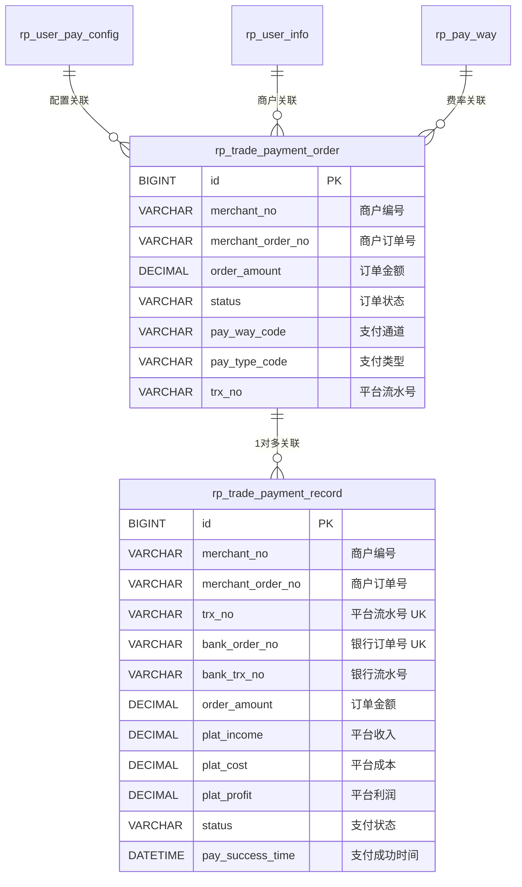

# 数据库设计：条码支付流程

## 表清单

| 表名 | 实体类 | 所属能力 | 操作类型 |
|------|--------|---------|---------|
| rp_trade_payment_order | RpTradePaymentOrder | CAP-02 | READ, WRITE |
| rp_trade_payment_record | RpTradePaymentRecord | CAP-02 | READ, WRITE |
| rp_user_pay_config | RpUserPayConfig | user模块 | READ |
| rp_user_info | RpUserInfo | user模块 | READ |
| rp_pay_way | RpPayWay | user模块 | READ |
| rp_user_pay_info | RpUserPayInfo | user模块 | READ |

---

## rp_trade_payment_order（支付订单表）

### 字段定义

| 字段名 | 类型 | 约束 | 说明 | 操作场景 |
|--------|------|------|------|---------|
| id | BIGINT | PK, AUTO_INCREMENT | 主键ID | 所有操作 |
| version | INT | NOT NULL, DEFAULT 0 | 乐观锁版本号 | 所有操作 |
| create_time | DATETIME | NOT NULL | 创建时间 | insert时设置 |
| creater | VARCHAR(50) | - | 创建人 | insert时设置 |
| edit_time | DATETIME | - | 最后修改时间 | update时更新 |
| editor | VARCHAR(50) | - | 修改人 | update时更新 |
| status | VARCHAR(50) | NOT NULL | 订单状态: WAITING_PAYMENT/SUCCESS/FAILED/CREATED/CANCELED | insert时=WAITING_PAYMENT, update时变更 |
| product_name | VARCHAR(200) | - | 商品名称 | insert时设置 |
| merchant_order_no | VARCHAR(50) | NOT NULL | 商户订单号 | insert时设置, 查询条件 |
| order_amount | DECIMAL(20,2) | NOT NULL | 订单金额 | insert时设置 |
| order_from | VARCHAR(50) | - | 订单来源 | insert时设置 |
| merchant_name | VARCHAR(200) | - | 商户名称 | insert时设置 |
| merchant_no | VARCHAR(50) | NOT NULL | 商户编号 | insert时设置, 查询条件 |
| order_time | DATETIME | - | 下单时间 | insert时设置 |
| order_date | DATE | - | 下单日期 | insert时设置 |
| order_ip | VARCHAR(20) | - | 下单IP | insert时设置 |
| order_referer_url | VARCHAR(500) | - | 来源URL | insert时设置 |
| return_url | VARCHAR(500) | - | 页面跳转地址 | insert时设置 |
| notify_url | VARCHAR(500) | - | 异步通知地址 | insert时设置 |
| cancel_reason | VARCHAR(500) | - | 取消原因 | 风控拒绝时设置 |
| order_period | INT | - | 订单有效期(分钟) | insert时设置 |
| expire_time | DATETIME | - | 过期时间 | insert时设置 |
| pay_way_code | VARCHAR(50) | - | 支付通道编码: WEIXIN/ALIPAY | update时设置(getF2FPayResultVo) |
| pay_way_name | VARCHAR(50) | - | 支付通道名称 | update时设置 |
| remark | VARCHAR(500) | - | 备注 | insert时设置 |
| trx_type | VARCHAR(50) | - | 交易类型: EXPENSE/REMIT/ERRORHANKLE | insert时设置 |
| trx_no | VARCHAR(50) | - | 平台交易流水号 | update时设置(completeSuccessOrder) |
| pay_type_code | VARCHAR(50) | - | 支付类型编码: MICRO_PAY/F2F_PAY | update时设置(getF2FPayResultVo) |
| pay_type_name | VARCHAR(50) | - | 支付类型名称 | update时设置 |
| fund_into_type | VARCHAR(50) | - | 资金流入类型: MERCHANT_RECEIVES/PLAT_RECEIVES | insert时设置 |
| is_refund | VARCHAR(10) | - | 是否退款: YES/NO | insert时设置 |
| refund_times | INT | - | 退款次数 | update时更新 |
| success_refund_amount | DECIMAL(20,2) | - | 成功退款金额 | update时更新 |
| field1-5 | VARCHAR(500) | - | 备注字段 | insert时设置 |

### 索引

| 索引名 | 字段 | 类型 | 用途 |
|--------|------|------|------|
| idx_merchant_order | merchant_no, merchant_order_no | UNIQUE | 通过商户号+商户订单号唯一查询订单 |

### 操作清单

| 操作 | 方法 | 场景 |
|------|------|------|
| SELECT | selectByMerchantNoAndMerchantOrderNo | 查询订单是否存在 |
| INSERT | insert | 创建新订单 |
| UPDATE | update | 更新支付类型/通道/状态/流水号 |

---

## rp_trade_payment_record（支付记录表）

### 字段定义

| 字段名 | 类型 | 约束 | 说明 | 操作场景 |
|--------|------|------|------|---------|
| id | BIGINT | PK, AUTO_INCREMENT | 主键ID | 所有操作 |
| version | INT | NOT NULL, DEFAULT 0 | 乐观锁版本号 | 所有操作 |
| create_time | DATETIME | NOT NULL | 创建时间 | insert时设置 |
| creater | VARCHAR(50) | - | 创建人 | insert时设置 |
| edit_time | DATETIME | - | 最后修改时间 | update时更新 |
| editor | VARCHAR(50) | - | 修改人 | update时更新 |
| status | VARCHAR(50) | NOT NULL | 支付状态: WAITING_PAYMENT/SUCCESS/FAILED | insert时=WAITING_PAYMENT, update时变更 |
| product_name | VARCHAR(200) | - | 商品名称 | insert时设置 |
| merchant_order_no | VARCHAR(50) | NOT NULL | 商户订单号 | insert时设置 |
| trx_no | VARCHAR(50) | NOT NULL, UNIQUE | 平台交易流水号 | insert时生成 |
| bank_order_no | VARCHAR(50) | NOT NULL, UNIQUE | 银行订单号 | insert时生成 |
| bank_trx_no | VARCHAR(50) | - | 银行交易流水号 | update时设置(completeSuccessOrder) |
| merchant_name | VARCHAR(200) | - | 商户名称 | insert时设置 |
| merchant_no | VARCHAR(50) | NOT NULL | 商户编号 | insert时设置 |
| payer_user_no | VARCHAR(50) | - | 付款方用户编号 | insert时设置 |
| payer_name | VARCHAR(50) | - | 付款方名称 | insert时设置 |
| payer_pay_amount | DECIMAL(20,2) | - | 付款方支付金额 | insert时设置 |
| payer_fee | DECIMAL(20,2) | - | 付款方手续费 | insert时设置 |
| payer_account_type | VARCHAR(50) | - | 付款方账户类型 | insert时设置 |
| receiver_user_no | VARCHAR(50) | - | 收款方用户编号 | insert时设置 |
| receiver_name | VARCHAR(50) | - | 收款方名称 | insert时设置 |
| receiver_pay_amount | DECIMAL(20,2) | - | 收款方到账金额 | insert时设置 |
| receiver_fee | DECIMAL(20,2) | - | 收款方手续费 | insert时设置 |
| receiver_account_type | VARCHAR(50) | - | 收款方账户类型 | insert时设置 |
| order_ip | VARCHAR(20) | - | 下单IP | insert时设置 |
| order_referer_url | VARCHAR(500) | - | 来源URL | insert时设置 |
| order_amount | DECIMAL(20,2) | NOT NULL | 订单金额 | insert时设置 |
| plat_income | DECIMAL(20,2) | - | 平台收入 | insert时计算 |
| fee_rate | DECIMAL(10,4) | - | 费率 | insert时设置 |
| plat_cost | DECIMAL(20,2) | - | 平台成本 | insert时计算 |
| plat_profit | DECIMAL(20,2) | - | 平台利润 | insert时计算 |
| return_url | VARCHAR(500) | - | 页面跳转地址 | insert时设置 |
| notify_url | VARCHAR(500) | - | 异步通知地址 | insert时设置 |
| pay_way_code | VARCHAR(50) | - | 支付通道编码 | insert时设置 |
| pay_way_name | VARCHAR(50) | - | 支付通道名称 | insert时设置 |
| pay_success_time | DATETIME | - | 支付成功时间 | update时设置(completeSuccessOrder) |
| complete_time | DATETIME | - | 完成时间 | update时设置 |
| is_refund | VARCHAR(10) | - | 是否退款 | insert时设置 |
| refund_times | INT | - | 退款次数 | update时更新 |
| success_refund_amount | DECIMAL(20,2) | - | 成功退款金额 | update时更新 |
| trx_type | VARCHAR(50) | - | 交易类型 | insert时设置 |
| order_from | VARCHAR(50) | - | 订单来源 | insert时设置 |
| pay_type_code | VARCHAR(50) | - | 支付类型编码 | insert时设置 |
| pay_type_name | VARCHAR(50) | - | 支付类型名称 | insert时设置 |
| fund_into_type | VARCHAR(50) | - | 资金流入类型 | insert时设置 |
| remark | VARCHAR(500) | - | 备注 | insert时设置 |
| bank_return_msg | VARCHAR(2000) | - | 银行返回消息 | update时设置 |
| field1-5 | VARCHAR(500) | - | 备注字段 | insert时设置 |

### 索引

| 索引名 | 字段 | 类型 | 用途 |
|--------|------|------|------|
| idx_trx_no | trx_no | UNIQUE | 通过平台交易流水号查询 |
| idx_bank_order_no | bank_order_no | UNIQUE | 通过银行订单号查询 |
| idx_merchant_status | merchant_no, status | INDEX | 按商户+状态查询 |

### 操作清单

| 操作 | 方法 | 场景 |
|------|------|------|
| INSERT | insert | 创建支付记录 |
| UPDATE | update | 更新状态/银行流水号/支付时间/返回消息 |
| SELECT | getByBankOrderNo | 通过银行订单号查询(异步通知场景) |
| SELECT | getByTrxNo | 通过平台流水号查询(订单查询场景) |
| SELECT | getSuccessRecordByMerchantNoAndMerchantOrderNo | 查询成功记录 |

---

## 实体关系图

