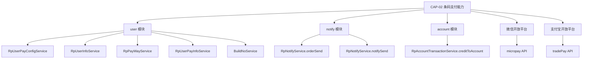

# 外部依赖图：条码支付流程

## 依赖概览

## 详细依赖清单

### 1. user 模块 — RpUserPayConfigService

| 属性 | 内容 |
|------|------|
| **依赖类** | RpUserPayConfigService |
| **依赖方法** | getByPayKey(String payKey) |
| **实现类** | RpUserPayConfigServiceImpl.getByPayKey() |
| **依赖类型** | @Autowired 注入 |
| **调用方** | CnpPayService.checkParamAndGetUserPayConfig() |
| **用途** | 通过商户payKey获取支付配置，验证商户身份和状态 |
| **失败影响** | 返回null → PayBizException → 请求被拒绝 |
| **返回数据** | RpUserPayConfig(payKey, userNo, productCode, paySecret, status) |

### 2. user 模块 — RpUserPayConfigService.getByUserNo()

| 属性 | 内容 |
|------|------|
| **依赖方法** | getByUserNo(String userNo) |
| **实现类** | RpUserPayConfigServiceImpl.getByUserNo() |
| **调用方** | RpTradePaymentManagerServiceImpl.getMerchantNotifyUrl() |
| **用途** | 通过商户号获取支付配置，用于构建商户通知URL |
| **失败影响** | 返回null → UserBizException → 通知URL构建失败 |

### 3. user 模块 — RpUserInfoService

| 属性 | 内容 |
|------|------|
| **依赖方法** | getDataByMerchentNo(String merchantNo) |
| **调用方** | RpTradePaymentManagerServiceImpl.f2fPay() |
| **用途** | 获取商户详细信息（商户名称等） |
| **失败影响** | 返回null → UserBizException("用户不存在") → 请求被拒绝 |
| **返回数据** | RpUserInfo(merchantNo, merchantName, status) |

### 4. user 模块 — RpPayWayService

| 属性 | 内容 |
|------|------|
| **依赖方法** | getByPayWayTypeCode(String productCode, String payWayCode, String payTypeCode) |
| **调用方** | RpTradePaymentManagerServiceImpl.f2fPay() |
| **用途** | 获取支付通道的费率配置 |
| **失败影响** | 返回null → UserBizException("用户支付配置有误") → 请求被拒绝 |
| **返回数据** | RpPayWay(payWayCode, payWayName, payTypeCode, payRate) |

### 5. user 模块 — RpUserPayInfoService

| 属性 | 内容 |
|------|------|
| **依赖方法** | getByUserNo(String userNo, String payWayCode) |
| **调用方** | RpTradePaymentManagerServiceImpl.getF2FPayResultVo() |
| **用途** | 获取商户支付渠道配置（appId, merchantId, partnerKey等） |
| **失败影响** | 返回null → UserBizException("商户支付配置有误") → 请求被拒绝 |

### 6. user 模块 — BuildNoService

| 属性 | 内容 |
|------|------|
| **依赖方法** | buildBankOrderNo(), buildTrxNo() |
| **实现类** | BuildNoServiceImpl |
| **调用方** | sealF2FRpTradePaymentOrder(), sealRpTradePaymentRecord() |
| **用途** | 生成银行订单号和平台交易流水号（基于雪花算法IdWorker） |
| **外部依赖** | IdWorker.getId() (mybatis-plus雪花算法) |

### 7. notify 模块 — RpNotifyService.orderSend()

| 属性 | 内容 |
|------|------|
| **依赖方法** | orderSend(String bankOrderNo) |
| **依赖类型** | @Autowired 注入，跨模块调用 |
| **调用方** | getF2FPayResultVo() — 当支付结果未知时 |
| **用途** | 发起订单轮询通知，由定时任务主动查询上游支付状态 |
| **失败影响** | 通知丢失 → 订单状态无法自动更新 → 需人工介入 |

### 8. notify 模块 — RpNotifyService.notifySend()

| 属性 | 内容 |
|------|------|
| **依赖方法** | notifySend(String notifyUrl, String orderNo, String merchantNo) |
| **依赖类型** | @Autowired 注入，跨模块调用 |
| **调用方** | completeSuccessOrder(), completeFailOrder() |
| **用途** | 异步通知商户支付结果（HTTP POST到商户notifyUrl） |
| **失败影响** | 商户未收到通知 → 商户系统状态不同步 → 需商户主动查询 |
| **通知内容** | payKey, productName, orderNo, orderPrice, payWayCode, tradeStatus, orderDate, orderTime, remark, trxNo, sign |

### 9. account 模块 — RpAccountTransactionService

| 属性 | 内容 |
|------|------|
| **依赖方法** | creditToAccount(String userNo, BigDecimal amount, String bankOrderNo, String bankTrxNo, String trxType, String remark) |
| **依赖类型** | @Autowired 注入，跨模块调用 |
| **调用方** | completeSuccessOrder() — 仅当fundIntoType=PLAT_RECEIVES时 |
| **用途** | 平台收款场景下，向商户账户加款（扣除平台收入后的金额） |
| **失败影响** | 事务回滚 → 订单状态不更新 → 数据一致性保证 |
| **入账金额** | orderAmount - platIncome（订单金额减去平台收入） |

### 10. 微信开放平台 — micropay API

| 属性 | 内容 |
|------|------|
| **API名称** | 微信刷卡支付API |
| **工具类** | WeiXinPayUtil.micropay() |
| **API地址** | https://api.mch.weixin.qq.com/pay/micropay |
| **调用方式** | HTTPS POST (XML) |
| **调用方** | getF2FPayResultVo() — 当payWayCode=WEIXIN时 |
| **请求参数** | out_trade_no(bankOrderNo), body(productName), total_fee(amount), spbill_create_ip(ip), auth_code |
| **返回结果** | return_code(通讯状态), result_code(业务状态), transaction_id(银行流水号), err_code(错误码), err_code_des(错误描述) |
| **失败影响** | 返回空 → 结果未知 → 发起订单轮询 网络超时 → 结果未知 → 发起订单轮询 |

### 11. 支付宝开放平台 — tradePay API

| 属性 | 内容 |
|------|------|
| **API名称** | 支付宝条码支付API |
| **工具类** | AliPayUtil.tradePay() |
| **SDK** | AlipayTradePayRequest (Alipay SDK) |
| **调用方式** | HTTPS (SDK) |
| **调用方** | getF2FPayResultVo() — 当payWayCode=ALIPAY时 |
| **请求参数** | out_trade_no(bankOrderNo), auth_code, subject(productName), total_amount |
| **返回结果** | trade_status, trade_no, out_trade_no, msg |
| **失败影响** | 统一发起订单轮询确认结果 |

## 依赖风险评估

| 依赖 | 风险等级 | 风险描述 | 缓解措施 |
|------|---------|---------|---------|
| 微信micropay API | 中 | 网络超时、微信系统异常 | 结果未知时发起轮询，USERPAYING等待用户输入 |
| 支付宝tradePay API | 中 | 支付宝系统异常 | 统一通过订单轮询确认结果 |
| user模块 | 低 | 商户配置/信息查询 | 配置缓存，查询失败直接拒绝请求 |
| notify模块 | 低 | 通知发送失败 | 通知有重试机制，商户可主动查询 |
| account模块 | 低 | 账户入账 | 事务保护，入账失败则回滚 |
