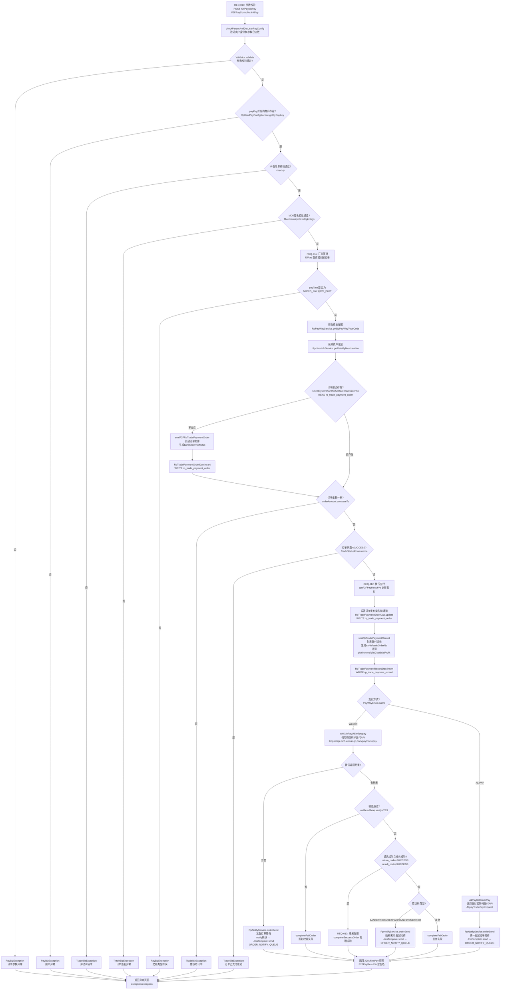
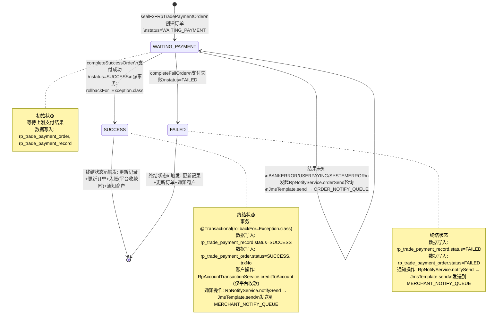
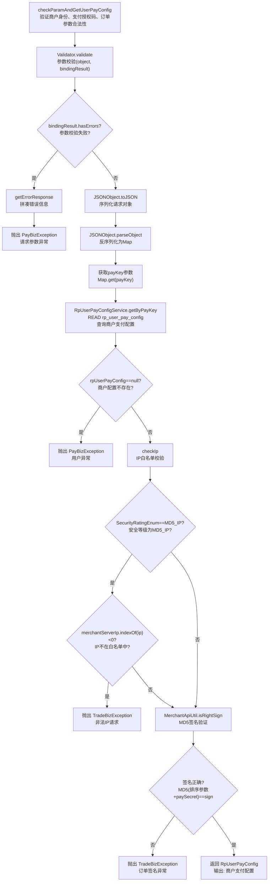
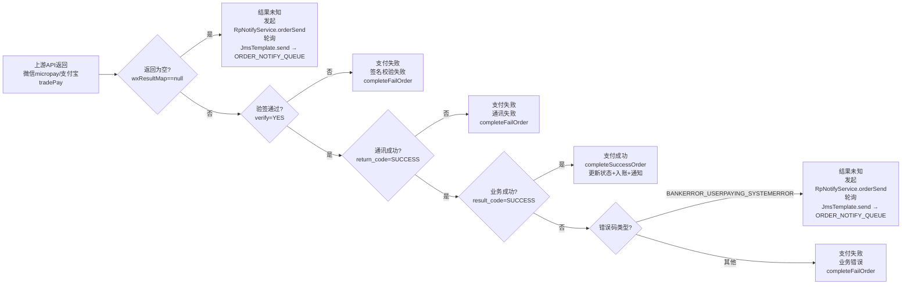
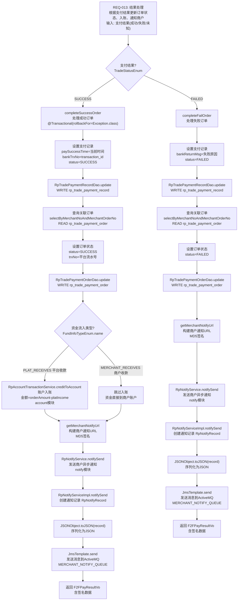
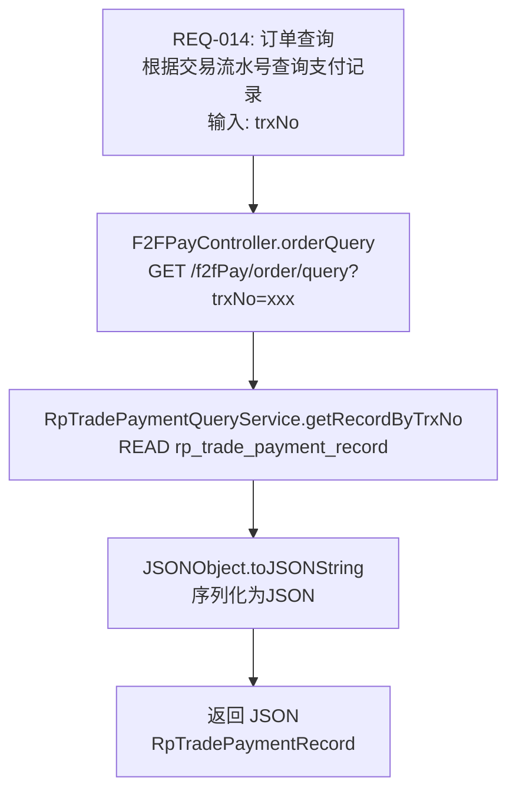
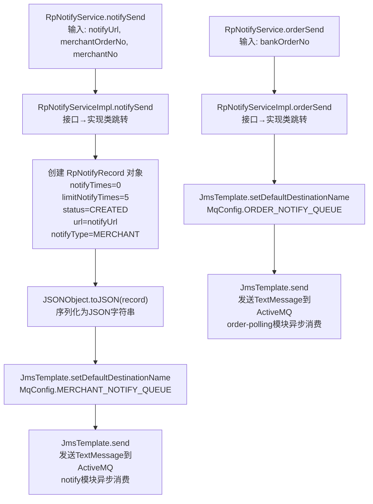

# 流程图：条码支付流程（F2FPayController.initPay）

## 需求→代码映射矩阵

| 需求ID | 业务目的 (Purpose) | 输入 (Input) | 输出 (Output) | 入口方法 | 调用链方法数 |
|--------|-------------------|-------------|--------------|---------|-------------|
| REQ-010 | 验证商户身份、支付授权码、订单参数合法性 | F2FPayRequestBo(payKey, authCode, productName, orderNo, orderPrice, orderIp) | RpUserPayConfig(商户支付配置) | F2FPayController.initPay | 13 |
| REQ-011 | 查询或创建支付订单，防止重复支付 | merchantNo, orderNo, orderPrice | RpTradePaymentOrder(已存在或新建) | RpTradePaymentManagerServiceImpl.f2fPay | 12 |
| REQ-012 | 调用微信micropay或支付宝tradePay完成条码支付 | bankOrderNo, authCode, productName, orderAmount, orderIp | 支付结果(成功/失败/未知) | RpTradePaymentManagerServiceImpl.getF2FPayResultVo | 13 |
| REQ-013 | 根据支付结果更新订单状态、入账、通知商户 | 支付结果(成功/失败/未知) | F2FPayResultVo(含签名) | RpTradePaymentManagerServiceImpl.completeSuccessOrder | 14 |
| REQ-014 | 根据交易流水号查询支付记录 | trxNo | RpTradePaymentRecord (JSON) | F2FPayController.orderQuery | 2 |

---

## 主流程图

## 状态流转图

## 子流程：参数校验流程（REQ-010）

## 子流程：支付结果判断逻辑（REQ-012）

## 子流程：结果处理流程（REQ-013）

## 子流程：订单查询流程（REQ-014）

## 子流程：通知发送流程（notify模块下钻）

