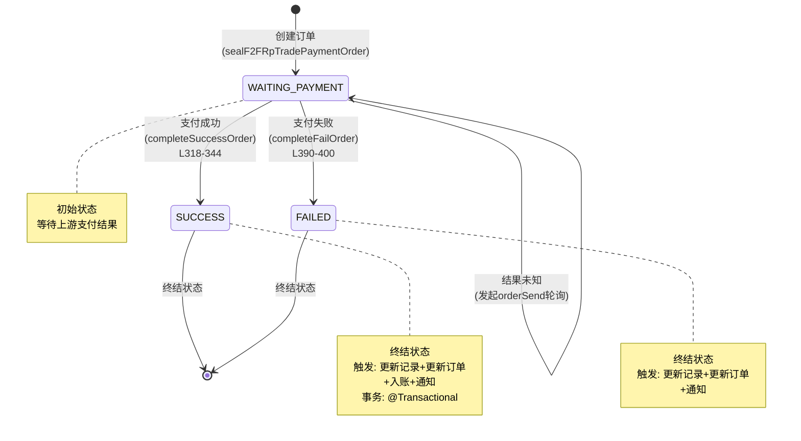
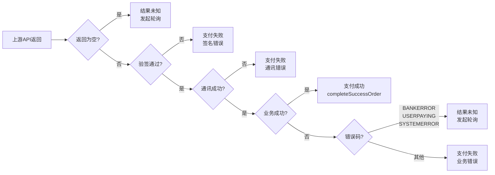

# 流程图

## 条码支付主流程

```mermaid
flowchart TD
    Start([商户发起条码支付]) --> A["POST /f2fPay/doPay"]
    A --> B["REQ-010: 参数校验<br/>F2FPayController.initPay()"]

    B --> B1{参数校验通过?}
    B1 -->|否| B_ERR[返回异常页面]
    B1 -->|是| C["REQ-011: 订单管理<br/>f2fPay()"]

    C --> C1{订单是否存在?}
    C1 -->|不存在| C2[创建订单<br/>sealF2FRpTradePaymentOrder]
    C2 --> C3[insert订单]
    C3 --> D
    C1 -->|已存在| C4{金额一致?}
    C4 -->|否| C_ERR1[异常: 错误的订单]
    C4 -->|是| C5{状态!=SUCCESS?}
    C5 -->|否| C_ERR2[异常: 订单已支付成功]
    C5 -->|是| D

    D["REQ-012: 执行支付<br/>getF2FPayResultVo()"]
    D --> D1[更新订单支付类型]
    D1 --> D2[封装支付记录<br/>sealRpTradePaymentRecord]
    D2 --> D3[insert支付记录]
    D3 --> D4{支付方式?}

    D4 -->|WEIXIN| D5[调用微信micropay]
    D5 --> D6{返回结果?}
    D6 -->|为空| D_POLL[结果未知<br/>orderSend轮询]
    D6 -->|有结果| D7{验签通过?}
    D7 -->|否| D_FAIL[completeFailOrder<br/>签名失败]
    D7 -->|是| D8{业务成功?}
    D8 -->|是| D_OK[completeSuccessOrder]
    D8 -->|否| D9{错误码类型?}
    D9 -->|BANKERROR<br/>USERPAYING<br/>SYSTEMERROR| D_POLL2[结果未知<br/>orderSend轮询]
    D9 -->|其他| D_FAIL2[completeFailOrder<br/>业务失败]

    D4 -->|ALIPAY| D10[调用支付宝tradePay]
    D10 --> D_POLL3[统一orderSend轮询]

    D_OK --> E["REQ-013: 结果处理"]
    D_FAIL --> E
    D_FAIL2 --> E
    D_POLL --> E
    D_POLL2 --> E
    D_POLL3 --> E

    E --> E1{支付结果?}
    E1 -->|SUCCESS| E2[更新记录=SUCCESS<br/>更新订单=SUCCESS<br/>账户入账(平台收款)<br/>notifySend通知商户]
    E1 -->|FAILED| E3[更新记录=FAILED<br/>更新订单=FAILED<br/>notifySend通知商户]
    E1 -->|WAITING| E4[保持等待状态]

    E2 --> END([返回支付结果页面])
    E3 --> END
    E4 --> END
    B_ERR --> END_ERR([结束])
    C_ERR1 --> END_ERR
    C_ERR2 --> END_ERR
```

## 订单状态流转图



## 支付结果判断逻辑


