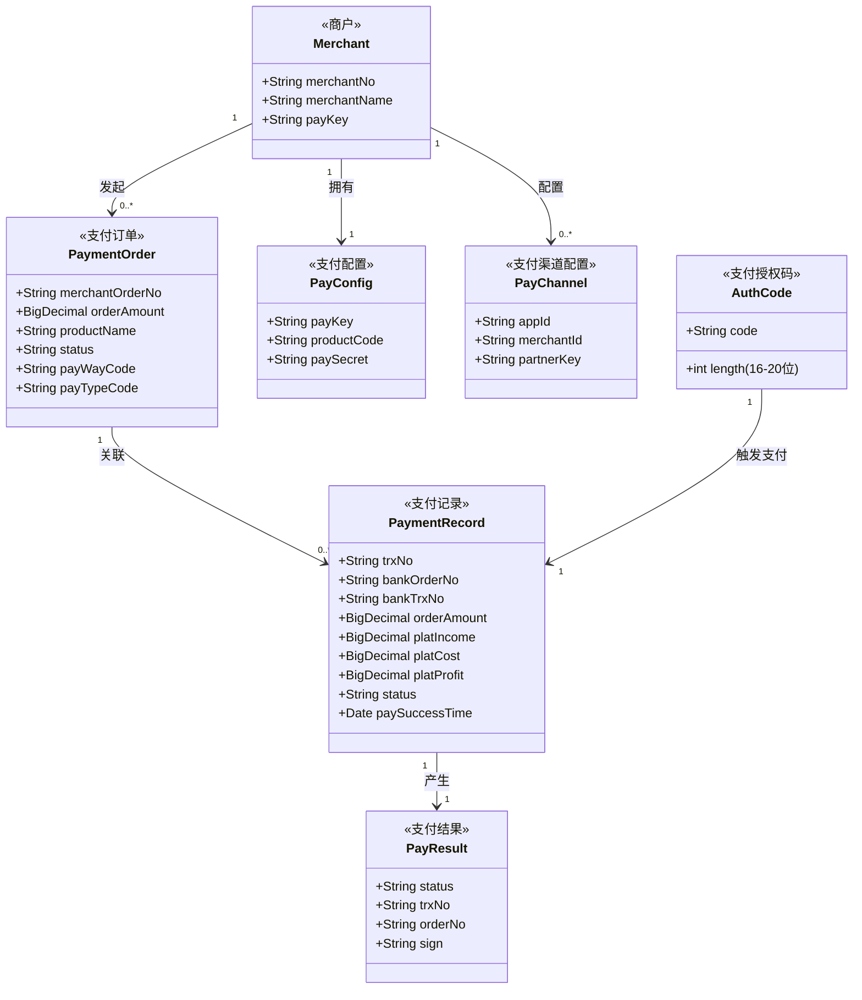
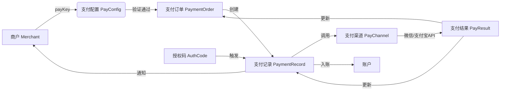

# 领域概念模型

## 概念关系图

## 概念说明

### 商户 (Merchant)

- **定义**: 接入支付平台的商家用户，通过 payKey 标识身份
- **关联概念**: 拥有支付配置(PayConfig)，可配置多个支付渠道(PayChannel)，发起多个支付订单(PaymentOrder)
- **数据流转**: 商户通过 payKey 发起支付请求 → 系统根据 payKey 查询 PayConfig 验证身份 → 创建 PaymentOrder

### 支付订单 (PaymentOrder)

- **定义**: 商户发起的支付请求，以 (merchantNo + merchantOrderNo) 为唯一标识
- **关联概念**: 属于某个商户(Merchant)，可关联多条支付记录(PaymentRecord)（重复支付尝试）
- **数据流转**: 商户请求 → 创建/查询订单 → 执行支付 → 更新状态(SUCCESS/FAILED)
- **状态机**: WAITING_PAYMENT → SUCCESS / FAILED

### 支付记录 (PaymentRecord)

- **定义**: 每次支付尝试的详细记录，包含金额明细（订单金额、平台收入、平台成本、平台利润）
- **关联概念**: 关联一个支付订单(PaymentOrder)，由支付授权码(AuthCode)触发，产生支付结果(PayResult)
- **数据流转**: 订单创建后 → 生成支付记录 → 调用上游API → 更新记录状态 → 入账 → 通知商户
- **关键字段**:
  - trxNo: 平台交易流水号（唯一标识一次支付尝试）
  - bankOrderNo: 发给银行/支付通道的订单号
  - bankTrxNo: 银行返回的交易流水号

### 支付配置 (PayConfig)

- **定义**: 商户的支付业务配置，包含 payKey（身份标识）、productCode（产品编码）、paySecret（签名密钥）
- **关联概念**: 属于某个商户(Merchant)，通过 payKey 关联
- **数据流转**: 请求到达 → 通过 payKey 查询 PayConfig → 验证商户身份和状态 → 获取 productCode 查询费率

### 支付渠道配置 (PayChannel)

- **定义**: 商户在特定支付通道（微信/支付宝）的配置，包含 appId、merchantId、partnerKey
- **关联概念**: 属于某个商户(Merchant)，按支付通道(WEIXIN/ALIPAY)区分
- **数据流转**: 执行支付时 → 根据 fundIntoType 获取对应 PayChannel → 使用 appId/partnerKey 调用上游API

### 支付授权码 (AuthCode)

- **定义**: 用户付款码，16-20位数字，由扫码枪读取
- **关联概念**: 触发一次支付记录(PaymentRecord)的创建
- **数据流转**: 商户扫码获取 → 随请求传入 → 传给微信micropay/支付宝tradePay API

### 支付结果 (PayResult)

- **定义**: 支付执行的结果，包含状态、交易流水号、签名
- **关联概念**: 由支付记录(PaymentRecord)产生
- **数据流转**: 上游API返回 → 验签 → 构建 PayResult → 返回给商户

## 概念间数据流转

