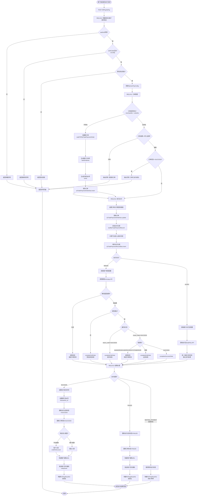
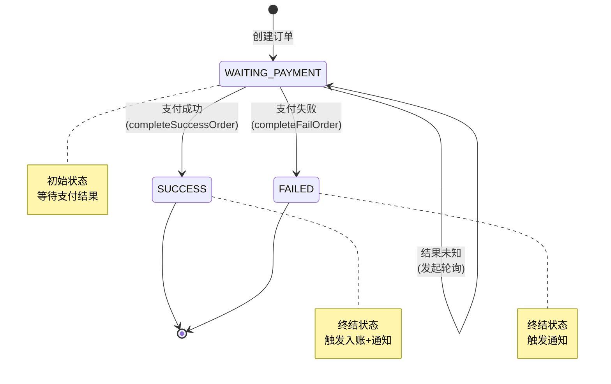
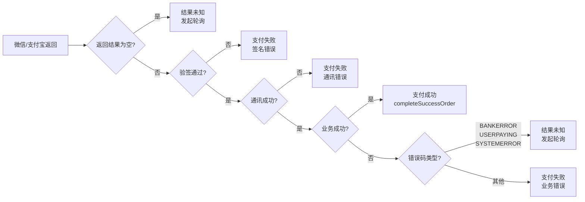

# F2FPayController.initPay 流程图、活动与业务规则详细说明

## 一、整体流程图



## 二、活动详细说明（ePAM活动层）

### ACT-01: 参数校验与商户身份验证

| 属性 | 内容 |
|------|------|
| **需求编号** | REQ-010 |
| **入口方法** | `F2FPayController.initPay()` |
| **前置条件** | 商户已注册并获取payKey |
| **后置条件** | 获取到有效的RpUserPayConfig |
| **数据读取** | F2FPayRequestBo(请求参数) |
| **数据写入** | 无 |

**执行步骤**:
```
1. F2FPayController.initPay() 接收 F2FPayRequestBo 参数
2. 调用 CnpPayService.checkParamAndGetUserPayConfig()
   2.1 验证 payKey 长度(16-32位)
   2.2 验证 authCode 长度(16-20位)
   2.3 验证 orderNo 长度(5-20位)
   2.4 验证 orderPrice 格式(最多12位整数+2位小数)
   2.5 验证 payType 非空
   2.6 验证签名 sign = MD5(排序参数 + paySecret)
   2.7 通过 payKey 查询 RpUserPayConfig
   2.8 验证商户状态是否正常
3. 返回 RpUserPayConfig
```

**异常处理**:
- 参数校验失败 → 抛出 BizException
- 签名验证失败 → 抛出 BizException
- 商户配置不存在 → 抛出 UserBizException

---

### ACT-02: 订单管理

| 属性 | 内容 |
|------|------|
| **需求编号** | REQ-011 |
| **入口方法** | `RpTradePaymentManagerServiceImpl.f2fPay()` |
| **前置条件** | 已通过参数校验，获取到RpUserPayConfig |
| **后置条件** | 获取到有效的RpTradePaymentOrder（新建或已存在） |
| **数据读取** | rp_trade_payment_order, rp_user_info, rp_pay_way |
| **数据写入** | rp_trade_payment_order (订单不存在时insert) |

**执行步骤**:
```
1. 验证交易类型: payType 必须是 MICRO_PAY 或 F2F_PAY
2. 根据 payType 获取 PayWayEnum (WEIXIN 或 ALIPAY)
3. 调用 rpPayWayService.getByPayWayTypeCode() 获取费率配置
4. 调用 rpUserInfoService.getDataByMerchentNo() 获取商户信息
5. 调用 rpTradePaymentOrderDao.selectByMerchantNoAndMerchantOrderNo()
   查询订单是否存在
6. 分支判断:
   6.1 订单不存在:
       - 调用 sealF2FRpTradePaymentOrder() 封装订单
       - 生成 bankOrderNo (银行订单号)
       - 生成 trxNo (平台交易流水号)
       - 设置订单状态 = WAITING_PAYMENT
       - 调用 rpTradePaymentOrderDao.insert() 保存
   6.2 订单已存在:
       - 校验 orderAmount == f2FPayRequestBo.orderPrice
       - 校验 status != SUCCESS
       - 校验通过则复用已有订单
```

**异常处理**:
- 交易类型不支持 → PayBizException
- 费率配置不存在 → UserBizException
- 商户不存在 → UserBizException
- 订单金额不匹配 → TradeBizException
- 订单已支付成功 → TradeBizException

---

### ACT-03: 执行支付

| 属性 | 内容 |
|------|------|
| **需求编号** | REQ-012 |
| **入口方法** | `RpTradePaymentManagerServiceImpl.getF2FPayResultVo()` |
| **前置条件** | 订单已创建/查询成功 |
| **后置条件** | 支付结果确定（成功/失败/未知） |
| **数据读取** | rp_user_pay_info (商户支付渠道配置) |
| **数据写入** | rp_trade_payment_record (insert) |

**执行步骤**:
```
1. 根据 payWayCode 设置订单的 payTypeCode 和 payWayName
2. 调用 rpTradePaymentOrderDao.update() 更新订单支付类型
3. 调用 sealRpTradePaymentRecord() 封装支付记录
   - 生成 trxNo (平台交易流水号)
   - 生成 bankOrderNo (银行订单号)
   - 计算 platIncome (平台收入) = orderAmount × payRate
   - 计算 platCost (平台成本)
   - 计算 platProfit (平台利润) = platIncome - platCost
4. 调用 rpTradePaymentRecordDao.insert() 保存支付记录
5. 分支判断支付方式:

   5.1 微信支付 (WEIXIN):
       - 获取商户微信配置 (appId, mchId, partnerKey)
       - 调用 WeiXinPayUtil.micropay(bankOrderNo, productName, amount, ip, authCode)
       - 判断返回结果:
         a) 返回为空 → 结果未知，调用 rpNotifyService.orderSend() 发起轮询
         b) 验签失败 → completeFailOrder("签名校验失败")
         c) return_code != SUCCESS → completeFailOrder("通讯失败")
         d) result_code != SUCCESS:
            - err_code = BANKERROR/USERPAYING/SYSTEMERROR → 结果未知，发起轮询
            - 其他错误码 → completeFailOrder(err_code_des)
         e) 全部成功 → completeSuccessOrder(transaction_id, timeEnd, msg)

   5.2 支付宝支付 (ALIPAY):
       - 获取商户支付宝配置 (appId, rsaPrivateKey)
       - 调用 AliPayUtil.tradePay(bankOrderNo, authCode, productName, amount)
       - 统一调用 rpNotifyService.orderSend() 发起订单轮询
         (支付宝条码支付不实时返回最终结果，需轮询确认)
```

**异常处理**:
- 商户支付渠道配置不存在 → UserBizException
- 微信API调用异常 → 结果未知，发起轮询
- 支付宝API调用异常 → TradeBizException

---

### ACT-04: 结果处理

| 属性 | 内容 |
|------|------|
| **需求编号** | REQ-013 |
| **入口方法** | `completeSuccessOrder()` / `completeFailOrder()` |
| **前置条件** | 支付结果已确定 |
| **后置条件** | 订单和记录状态已更新，商户已通知 |
| **数据读取** | rp_trade_payment_record, rp_trade_payment_order |
| **数据写入** | rp_trade_payment_record, rp_trade_payment_order |

**执行步骤 - 成功场景 (completeSuccessOrder)**:
```
1. 设置支付记录的 paySuccessTime = 当前时间
2. 设置支付记录的 bankTrxNo = transaction_id (微信返回)
3. 设置支付记录的 bankReturnMsg = 银行返回消息
4. 设置支付记录的状态 = SUCCESS
5. 调用 rpTradePaymentRecordDao.update() 更新支付记录
6. 查询关联的订单 rpTradePaymentOrder
7. 设置订单状态 = SUCCESS
8. 设置订单的 trxNo = 平台交易流水号
9. 调用 rpTradePaymentOrderDao.update() 更新订单
10. 判断资金流入类型:
    - 平台收款: 调用 rpAccountTransactionService.creditToAccount() 入账
    - 商户收款: 跳过入账（资金直接到商户账户）
11. 调用 getMerchantNotifyUrl() 构建商户通知URL
    - 拼接参数: payKey, productName, orderNo, orderPrice, payWayCode, 
                tradeStatus, orderDate, orderTime, remark, trxNo
    - 计算签名: sign = MD5(排序参数 + paySecret)
    - 拼接URL: sourceUrl + "?" + paramStr + "&sign=" + sign
12. 调用 rpNotifyService.notifySend(notifyUrl, orderNo, merchantNo) 发送通知
13. 构建 F2FPayResultVo，包含签名数据
14. 返回视图名称 "/f2fAffirmPay"
```

**执行步骤 - 失败场景 (completeFailOrder)**:
```
1. 设置支付记录的 bankReturnMsg = 失败原因
2. 设置支付记录的状态 = FAILED
3. 调用 rpTradePaymentRecordDao.update() 更新支付记录
4. 查询关联的订单 rpTradePaymentOrder
5. 设置订单状态 = FAILED
6. 调用 rpTradePaymentOrderDao.update() 更新订单
7. 调用 getMerchantNotifyUrl() 构建商户通知URL
8. 调用 rpNotifyService.notifySend() 发送通知
9. 构建 F2FPayResultVo，包含签名数据
10. 返回视图名称 "/f2fAffirmPay"
```

**事务边界**:
- `completeSuccessOrder()` 标注 `@Transactional(rollbackFor = Exception.class)`
- 任何一步失败都会回滚整个事务

---

### ACT-05: 订单查询

| 属性 | 内容 |
|------|------|
| **需求编号** | REQ-014 |
| **入口方法** | `F2FPayController.orderQuery()` |
| **前置条件** | 已知交易流水号trxNo |
| **后置条件** | 返回支付记录JSON |
| **数据读取** | rp_trade_payment_record |
| **数据写入** | 无 |

**执行步骤**:
```
1. 接收 trxNo 参数
2. 调用 queryService.getRecordByTrxNo(trxNo)
3. 序列化为 JSON 返回
```

---

## 三、业务规则详细说明

### RULE-01: 订单幂等控制

| 属性 | 内容 |
|------|------|
| **规则描述** | 同一(商户号 + 商户订单号)只能有一个活跃订单 |
| **实现位置** | `f2fPay()` L197-L211 |
| **判断逻辑** | `selectByMerchantNoAndMerchantOrderNo(merchantNo, orderNo)` |
| **违规处理** | 订单已存在时复用，不创建新订单 |

**代码片段**:
```java
RpTradePaymentOrder rpTradePaymentOrder = rpTradePaymentOrderDao
    .selectByMerchantNoAndMerchantOrderNo(merchantNo, f2FPayRequestBo.getOrderNo());
if (rpTradePaymentOrder == null) {
    // 订单不存在，创建新订单
    rpTradePaymentOrder = sealF2FRpTradePaymentOrder(...);
    rpTradePaymentOrderDao.insert(rpTradePaymentOrder);
} else {
    // 订单已存在，校验金额和状态
}
```

---

### RULE-02: 订单金额一致性

| 属性 | 内容 |
|------|------|
| **规则描述** | 已存在订单的金额必须与传入金额完全一致 |
| **实现位置** | `f2fPay()` L204-L206 |
| **判断逻辑** | `rpTradePaymentOrder.getOrderAmount().compareTo(f2FPayRequestBo.getOrderPrice()) != 0` |
| **违规处理** | 抛出 TradeBizException("错误的订单") |

---

### RULE-03: 防重复支付

| 属性 | 内容 |
|------|------|
| **规则描述** | 已支付成功的订单不能重复支付 |
| **实现位置** | `f2fPay()` L208-L210 |
| **判断逻辑** | `TradeStatusEnum.SUCCESS.name().equals(rpTradePaymentOrder.getStatus())` |
| **违规处理** | 抛出 TradeBizException("订单已支付成功,无需重复支付") |

---

### RULE-04: 交易类型限制

| 属性 | 内容 |
|------|------|
| **规则描述** | 条码支付只支持微信MICRO_PAY和支付宝F2F_PAY两种交易类型 |
| **实现位置** | `f2fPay()` L175-L178 |
| **判断逻辑** | `!PayTypeEnum.F2F_PAY.name().equals(payType) && !PayTypeEnum.MICRO_PAY.name().equals(payType)` |
| **违规处理** | 抛出 PayBizException("交易类型有误，不支持该交易") |

---

### RULE-05: 微信支付结果验签

| 属性 | 内容 |
|------|------|
| **规则描述** | 微信返回的支付结果必须通过签名验证 |
| **实现位置** | `getF2FPayResultVo()` L254 |
| **判断逻辑** | `"YES".equals(wxResultMap.get("verify"))` |
| **违规处理** | 调用 completeFailOrder("签名校验失败!") |

---

### RULE-06: 微信错误码分类处理

| 属性 | 内容 |
|------|------|
| **规则描述** | 根据微信返回的错误码决定是失败还是轮询 |
| **实现位置** | `getF2FPayResultVo()` L259 |
| **判断逻辑** | 以下错误码视为"结果未知"，需轮询确认:<br/>- BANKERROR: 银行系统异常<br/>- USERPAYING: 用户正在输入密码<br/>- SYSTEMERROR: 微信系统异常 |
| **其他错误码** | 视为支付失败，直接调用 completeFailOrder() |

---

### RULE-07: 支付宝统一轮询

| 属性 | 内容 |
|------|------|
| **规则描述** | 支付宝条码支付不实时处理结果，统一通过订单轮询确认 |
| **实现位置** | `getF2FPayResultVo()` L279 |
| **判断逻辑** | 调用 AliPayUtil.tradePay() 后，无论返回什么，都调用 `rpNotifyService.orderSend()` |
| **原因** | 支付宝条码支付可能存在延迟，轮询机制确保结果准确性 |

---

### RULE-08: 平台收款入账

| 属性 | 内容 |
|------|------|
| **规则描述** | 仅当资金流入类型为"平台收款"时，才执行账户入账操作 |
| **实现位置** | `completeSuccessOrder()` L331-L333 |
| **判断逻辑** | `FundInfoTypeEnum.PLAT_RECEIVES.name().equals(rpTradePaymentRecord.getFundIntoType())` |
| **入账金额** | `orderAmount - platIncome` (订单金额减去平台收入) |
| **商户收款** | 资金直接到商户账户，平台不执行入账 |

---

### RULE-09: 商户通知签名

| 属性 | 内容 |
|------|------|
| **规则描述** | 发送给商户的异步通知URL必须携带签名 |
| **实现位置** | `getMerchantNotifyUrl()` L378-L380 |
| **签名算法** | `sign = MD5(排序参数拼接 + paySecret)` |
| **通知参数** | payKey, productName, orderNo, orderPrice, payWayCode, tradeStatus, orderDate, orderTime, remark, trxNo |

---

### RULE-10: 事务一致性

| 属性 | 内容 |
|------|------|
| **规则描述** | 支付成功时的状态更新和入账操作必须在同一事务中 |
| **实现位置** | `completeSuccessOrder()` 方法注解 |
| **事务注解** | `@Transactional(rollbackFor = Exception.class)` |
| **事务范围** | 更新支付记录 → 更新订单 → 账户入账 → 构建通知URL |
| **回滚条件** | 任何 Exception 及其子类都会触发回滚 |

---

## 四、状态机

### 订单状态流转



### 支付结果判断逻辑


