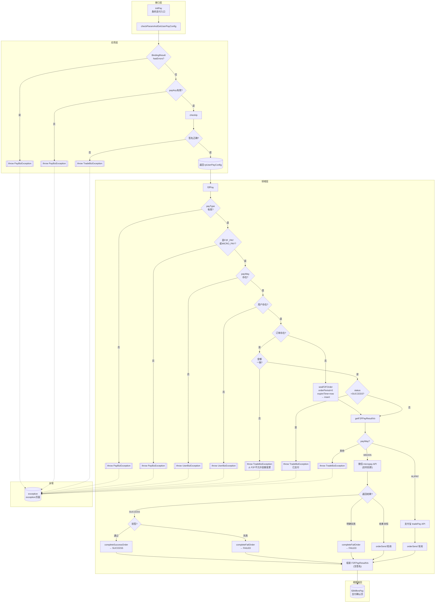

# 业务流程分析: `com.roncoo.pay.controller.F2FPayController#initPay`

> 分析日期: 2026-05-15
> 入口: `F2FPayController.initPay()` (roncoo-pay-web-gateway/.../F2FPayController.java:50)

---

## 一、流程总览

```
商户系统发起条码支付请求 (被扫支付)
  │
  ▼
[1] initPay (控制器入口)
  │
  ├─[2] checkParamAndGetUserPayConfig (参数校验 + 商户配置加载)
  │     ├─ Bean Validation 注解校验 (F2FPayRequestBo)
  │     ├─ 根据 payKey 查询商户支付配置 (RpUserPayConfig)
  │     ├─ IP 白名单校验 (checkIp, 可选)
  │     └─ MD5 签名校验 (MerchantApiUtil.isRightSign)
  │
  └─[3] f2fPay (条码支付领域服务)
        ├─ 校验支付类型枚举 (F2F_PAY 或 MICRO_PAY)
        ├─ 查询支付方式 (RpPayWay) + 费率
        ├─ 查询商户信息 (RpUserInfo)
        ├─ 查订单/新建订单 (sealF2FRpTradePaymentOrder)
        │     ├─ 订单不存在 → 创建(WAITING_PAYMENT), expireTime=new Date(), orderPeriod=0
        │     ├─ 订单已存在 + 金额不一致 → **直接抛异常** (与 ScanPay 不同!)
        │     └─ 订单已存在 + 已支付成功 → 拒绝
        └─[4] getF2FPayResultVo
              ├─ 根据 payWayCode 设定 payType (MICRO_PAY/F2F_PAY)
              ├─ 更新订单支付方式 → 创建支付记录
              ├─ 调用第三方支付渠道:
              │    ├─ 微信: micropay API (实时返回结果)
              │    │     ├─ 成功 → completeSuccessOrder
              │    │     ├─ 明确失败 → completeFailOrder
              │    │     └─ 结果未知 → orderSend 轮询
              │    └─ 支付宝: tradePay API → orderSend 轮询
              └─ 返回 F2FPayResultVo(含签名) → 跳转 f2fAffirmPay 页面
```

**与 ScanPay initPay 的关键差异:**
1. F2FPay 是**被扫支付**(收银员扫用户付款码)，不需要 code_url，实时扣款
2. 重复下单时**金额不一致直接抛异常**，不更新金额
3. 订单有效期 **orderPeriod=0, expireTime=new Date()**，即立即过期
4. F2FPayRequestBo **没有 returnUrl/notifyUrl/orderPeriod/numberOfStages** 字段
5. F2FPayRequestBo **有 authCode**(支付授权码，即付款码)
6. 返回 **F2FPayResultVo** 带签名，前端可验证
7. 结束页面是 **f2fAffirmPay**(支付确认页)，非扫码页

---

## 二、实体及属性

### 2.1 F2FPayRequestBo — 条码支付请求 (输入值对象)

| 属性 | 类型 | 校验规则 | 说明 |
|------|------|----------|------|
| payKey | String | @NotNull, @Size(min=16, max=32) | 商户Key |
| **authCode** | String | @NotNull, @Size(min=16, max=20) | **支付授权码(付款码)** (F2F特有) |
| productName | String | @NotNull, @Size(max=200) | 商品名称 |
| orderNo | String | @NotNull, @Size(min=5, max=20) | 商户订单号 (幂等键) |
| orderPrice | BigDecimal | @NotNull, @Digits(integer=12, fraction=2) | 订单金额 |
| orderIp | String | @NotNull, @Size(min=1, max=20) | 下单IP |
| orderDate | String | @NotNull, @Size(min=1, max=8) | 订单日期 (yyyyMMdd) |
| orderTime | String | @NotNull, @Size(min=1, max=14) | 订单时间 (yyyyMMddHHmmss) |
| sign | String | @NotNull | MD5签名 |
| payType | String | @NotNull, @Size(min=1, max=14) | **支付类型(必填)**, 必须 F2F_PAY/MICRO_PAY |
| remark | String | (可选) | 支付备注 |

**与 ScanPayRequestBo 的差异:**
- 新增 `authCode` (必填)
- 移除 `returnUrl`, `notifyUrl`, `orderPeriod`, `numberOfStages`
- `payType` 在 ScanPay 可选(路由用)，在 F2F 必填

### 2.2 F2FPayResultVo — 条码支付结果 (输出值对象)

| 属性 | 类型 | 说明 |
|------|------|------|
| **status** | String | 交易状态 (WAITING_PAYMENT/SUCCESS/FAILED) |
| trxNo | String | 交易流水号 |
| orderNo | String | 商户订单号 |
| payKey | String | 支付Key |
| productName | String | 产品名称 |
| remark | String | 支付备注 |
| orderIp | String | 下单IP |
| field1~5 | String | 扩展字段 |
| **sign** | String | 返回结果的MD5签名(前端可验签) |

### 2.3 RpTradePaymentOrder — 支付订单聚合根 (复用)

继承 BaseEntity。关键属性: status(order状态), orderAmount(无守卫), expireTime, payWayCode, payTypeCode, fundIntoType。详见 ScanPay 分析。

### 2.4 RpUserPayConfig — 商户支付配置 (复用)

继承 BaseEntity。payKey, paySecret, userNo, productCode, fundIntoType, securityRating, merchantServerIp。

---

## 三、活动

### 3.1 活动列表

| 活动名 | 方法 | 所属分层 | 说明 |
|--------|------|----------|------|
| 发起条码支付 | F2FPayController.initPay() | 接口层 | 统一入口，直接调用领域服务 |
| 参数校验与配置获取 | CnpPayService.checkParamAndGetUserPayConfig() | 应用服务 | (复用) 多层校验后获取 RpUserPayConfig |
| IP安全校验 | CnpPayService.checkIp() | 应用服务 | (复用) MD5_IP 模式下校验请求IP |
| 条码支付 | RpTradePaymentManagerServiceImpl.f2fPay() | 领域服务 | 核心领域服务: 校验→查订单→创建→调用渠道 |
| 条码订单封装 | sealF2FRpTradePaymentOrder() | 领域服务(工厂) | 将请求BO+配置组装为支付订单，orderPeriod=0, expireTime=now |
| 条码支付结果处理 | getF2FPayResultVo() | 领域服务 | 创建支付记录 + 调用微信/支付宝 + 处理实时结果 |
| 支付记录封装 | sealRpTradePaymentRecord() | 领域服务(工厂) | (复用) 生成支付流水号并封装支付记录 |
| 支付成功处理 | completeSuccessOrder() | 领域服务 | (复用) 更新记录+订单为SUCCESS，信用入账，异步通知 |
| 支付失败处理 | completeFailOrder() | 领域服务 | (复用) 更新记录+订单为FAILED，异步通知 |

### 3.2 决策点清单

| 编号 | 所在方法 | 行号 | 决策类型 | 条件 | 动作 |
|------|---------|------|---------|------|------|
| D01 | initPay | 54 | try | 整段业务逻辑 | 捕获 BizException/Exception |
| D02 | initPay | 63 | catch | BizException | modelMap.put(errorMsg) → 返回 exception/exception |
| D03 | initPay | 67 | catch | Exception | modelMap.put(errorMsg="系统异常") → 返回 exception/exception |
| D04 | f2fPay | 170 | if | payType==null | throw PayBizException("请求参数异常") |
| D05 | f2fPay | 175 | if | payType 非 F2F_PAY 且非 MICRO_PAY | throw PayBizException("不支持该交易") |
| D06 | f2fPay | 185 | if | payWay==null | throw UserBizException("用户支付配置有误") |
| D07 | f2fPay | 192 | if | rpUserInfo==null | throw UserBizException("用户不存在") |
| D08 | f2fPay | 198 | if | 订单不存在 | sealF2FRpTradePaymentOrder → insert |
| D09 | f2fPay | 204 | if | 订单存在 AND 金额不一致 | throw TradeBizException("错误的订单") |
| D10 | f2fPay | 208 | if | 订单存在 AND status=SUCCESS | throw TradeBizException("订单已支付成功") |
| D11 | checkParamAndGetUserPayConfig | 74 | if | bindingResult.hasErrors() | throw PayBizException(REQUEST_PARAM_ERR) |
| D12 | checkParamAndGetUserPayConfig | 88 | if | rpUserPayConfig==null | throw PayBizException(USER_PAY_CONFIG_IS_NOT_EXIST) |
| D13 | checkParamAndGetUserPayConfig | 93 | 调用 | checkIp | IP校验 → 不通过则 throw 异常 |
| D14 | checkParamAndGetUserPayConfig | 96 | if | 签名验证失败 | throw TradeBizException(TRADE_ORDER_ERROR) |

**决策分支总数: 14** (F2FPay 流程比 ScanPay 简洁得多 — 单一路径, 无 payWay 分发)

---

## 四、业务规则入口（按 12 类框架）

### 4.1 校验规则 (已发现 11 条)

| # | 规则 | 字段 | 实现 |
|---|------|------|------|
| R1 | @NotNull + @Size(16,32) | payKey | F2FPayRequestBo.java:14-15 |
| R2 | @NotNull + @Size(16,20) | authCode | F2FPayRequestBo.java:18-19 |
| R3 | @NotNull + @Size(max=200) | productName | F2FPayRequestBo.java:22-23 |
| R4 | @NotNull + @Size(5,20) | orderNo | F2FPayRequestBo.java:26-27 |
| R5 | @NotNull + @Digits(12,2) | orderPrice | F2FPayRequestBo.java:30-31 |
| R6 | @NotNull + @Size(1,20) | orderIp | F2FPayRequestBo.java:34-35 |
| R7 | @NotNull + @Size(1,8) | orderDate | F2FPayRequestBo.java:38-39 |
| R8 | @NotNull + @Size(1,14) | orderTime | F2FPayRequestBo.java:42-43 |
| R9 | @NotNull | sign | F2FPayRequestBo.java:46-47 |
| R10 | @NotNull + @Size(1,14) | payType | F2FPayRequestBo.java:51-52 |
| — | payType 必须是 F2F_PAY 或 MICRO_PAY | f2fPay:175 |

### 4.2 存在性规则 (已发现 5 条)

| # | 规则 | 实现 |
|---|------|------|
| — | payKey → RpUserPayConfig 必须存在 | checkParamAndGetUserPayConfig:88 |
| — | payWay 必须存在并已配置 | f2fPay:185 |
| — | rpUserInfo 必须存在 | f2fPay:192 |
| — | (merchantNo, orderNo) 唯一确定订单 | selectByMerchantNoAndMerchantOrderNo |
| — | 微信支付时 RpUserPayInfo 必须存在 | getF2FPayResultVo (WEIXIN分支) |

### 4.3 安全规则 (已发现 3 条)

| # | 规则 | 实现 |
|---|------|------|
| — | IP 白名单 (安全等级=MD5_IP) | CnpPayService.checkIp() |
| — | MD5 请求签名验证 | checkParamAndGetUserPayConfig():96 |
| — | 微信返回结果签名验证 + 支付宝返回签名验证 | getF2FPayResultVo |

### 4.4 不变规则 (已发现 3 条)

| # | 规则 | 实现 |
|---|------|------|
| I1 | (merchantNo, orderNo) 唯一 | Dao 查询 |
| I2 | SUCCESS 订单不可重复支付 | f2fPay:208 |
| I3 | **金额不可变更**: 已有订单金额与请求金额不一致时直接抛异常 | f2fPay:204-205 |

**I3 是 F2F 与 ScanPay 的关键差异: ScanPay 允许金额覆盖，F2F 不允许。**

### 4.5 计算规则 (已发现 2 条)

| # | 规则 | 实现 |
|---|------|------|
| — | MD5 签名计算与验证 | MerchantApiUtil |
| — | F2FPayResultVo 返回签名计算 | getF2FPayResultVo |
| — | expireTime = new Date() (条码支付即时过期) | sealF2FRpTradePaymentOrder |
| — | orderPeriod = 0 (条码支付无有效期) | sealF2FRpTradePaymentOrder |

### 4.6 状态转换规则 (已发现 3 条)

| # | 转换 | 触发条件 |
|---|------|----------|
| — | 初始 → WAITING_PAYMENT | sealF2F → insert |
| — | WAITING_PAYMENT → SUCCESS | 微信返回SUCCESS且验签通过; 支付宝轮询成功 |
| — | WAITING_PAYMENT → FAILED | 微信返回明确错误码; 微信验签失败 |

### 4.7 路由规则 (已发现 1 条)

| # | 条件 | 结果 |
|---|------|------|
| — | payWayCode=WEIXIN | 调用微信 micropay API → 实时处理结果 |
| — | payWayCode=ALIPAY | 调用支付宝 tradePay API → orderSend 轮询 |
| — | 其他 payWayCode | throw TradeBizException |

### 4.8 幂等规则 (已发现 2 条)

| # | 规则 | 说明 |
|---|------|------|
| — | (merchantNo, orderNo) 创建幂等 | 同 ScanPay |
| — | 金额严格幂等: 不一致则报错 | 与 ScanPay 不同 — F2F 不允许金额变更 |

### 4.9 补偿规则 (已发现 4 条)

| # | 规则 | 实现 |
|---|------|------|
| — | 微信明确失败 → completeFailOrder 更新记录+订单为FAILED | getF2FPayResultVo |
| — | 微信验签失败 → completeFailOrder | getF2FPayResultVo |
| — | 微信结果未知 → orderSend 启动轮询 | getF2FPayResultVo |
| — | 支付宝 → 统一 orderSend 启动轮询 | getF2FPayResultVo |

### 4.10 其他规则（审计/通知/时间）

同 ScanPay initPay 的共用部分（checkParamAndGetUserPayConfig 路径一致）。F2FPay 特有的：orderSend 轮询通知、completeSuccessOrder/completeFailOrder 的补偿处理。

---

## 五、领域事件

| # | 事件名 | 触发时机 | 所属聚合 | 携带数据 |
|---|--------|----------|----------|----------|
| E1 | RequestValidated | Bean Validation 通过 | 应用层 | F2FPayRequestBo 所有字段(含authCode) |
| E2 | MerchantSecurityVerified | payKey+IP+签名验证通过 | RpUserPayConfig | payKey, merchantNo, paySecret |
| E3 | PayTypeVerified | payType 是 F2F_PAY 或 MICRO_PAY | PayTypeEnum | payType, payWayCode |
| E4 | PayConfigVerified | payWay 查询存在 | RpPayWay | payWayCode, payRate |
| E5 | MerchantInfoVerified | rpUserInfo 查询存在 | RpUserInfo | merchantNo, merchantName |
| E6 | PayOrderCreated | 订单不存在→新建 | RpTradePaymentOrder | orderId, orderAmount, orderPeriod=0, expireTime=now |
| E7 | **PayOrderAmountConflict** | 重复下单,金额不一致 | RpTradePaymentOrder | oldAmount, newAmount (→ 抛异常, F2F特有) |
| E8 | DuplicateOrderRejected | 重复下单,已SUCCESS | RpTradePaymentOrder | orderId (→ 抛异常) |
| E9 | PayRecordCreated | 创建支付记录 | RpTradePaymentRecord | recordId, bankOrderNo |
| E10 | ThirdPartyPaymentRequested | 调用微信micropay/支付宝tradePay | RpTradePaymentRecord | payWayCode, bankOrderNo, authCode |
| E11 | **PaymentSucceeded** | 微信返回SUCCESS+验签OK | RpTradePaymentOrder+Record | bankTrxNo, orderAmount |
| E12 | **PaymentFailed** | 微信返回明确失败/验签失败 | RpTradePaymentOrder+Record | errCode, errMsg |
| E13 | **PaymentUncertain** | 微信/支付宝结果未知 | RpTradePaymentRecord | bankOrderNo (→ 轮询) |
| E14 | F2FPayResultReturned | 返回 F2FPayResultVo(含签名) | 展示层 | status, trxNo, orderNo, sign |

---

## 六、DDD 分层映射

```
┌─────────────────────────────────────────────────────────┐
│  接口层 (roncoo-pay-web-gateway)                        │
│  F2FPayController.initPay()                             │
│  → 调用 CnpPayService (应用服务)                         │
│  → 调用 RpTradePaymentManagerService.f2fPay()           │
│  → 返回 "f2fAffirmPay" 页面                             │
└────────────────────┬────────────────────────────────────┘
                     │
┌────────────────────▼────────────────────────────────────┐
│  应用层 (roncoo-pay-web-gateway)                        │
│  CnpPayService                                          │
│  ├─ checkParamAndGetUserPayConfig()                     │
│  ├─ checkIp()                                           │
│  └─ getErrorResponse()                                  │
└────────────────────┬────────────────────────────────────┘
                     │
┌────────────────────▼────────────────────────────────────┐
│  领域服务层 (roncoo-pay-service)                         │
│  RpTradePaymentManagerServiceImpl                       │
│  ├─ f2fPay()                     — 条码支付领域服务       │
│  ├─ sealF2FRpTradePaymentOrder() — 订单工厂(orderPeriod=0)│
│  ├─ getF2FPayResultVo()          — 支付渠道调用编排      │
│  ├─ completeSuccessOrder()       — 支付成功事务处理      │
│  ├─ completeFailOrder()          — 支付失败事务处理      │
│  └─ sealRpTradePaymentRecord()   — 支付记录工厂          │
└────────────────────┬────────────────────────────────────┘
                     │
┌────────────────────▼────────────────────────────────────┐
│  领域模型 (roncoo-pay-service + roncoo-pay-common-core)  │
│  聚合根: RpTradePaymentOrder, RpUserPayConfig            │
│  实体: RpTradePaymentRecord, RpUserInfo, RpUserPayInfo   │
│  值对象: F2FPayRequestBo, F2FPayResultVo                 │
│  枚举: PayTypeEnum(F2F_PAY/MICRO_PAY), PayWayEnum        │
└────────────────────┬────────────────────────────────────┘
                     │
┌────────────────────▼────────────────────────────────────┐
│  基础设施层                                              │
│  ├─ RpTradePaymentOrderDao / RpTradePaymentRecordDao    │
│  ├─ RpUserPayConfigService / RpUserInfoService          │
│  ├─ RpPayWayService / RpUserPayInfoService              │
│  ├─ RpNotifyService.orderSend (异步通知/轮询)            │
│  ├─ 微信 micropay API / 支付宝 tradePay API             │
│  └─ MerchantApiUtil (MD5签名计算与验证)                  │
└─────────────────────────────────────────────────────────┘
```

---

## 七、活动图



---

## 八、自检清单

| 维度 | 数据源 | 数量 | 图上标注 | 覆盖率 | 遗漏项 |
|------|--------|------|---------|--------|--------|
| 调用方法 | outgoing.calls 去重（核心） | 9 | 9 | 100% | — |
| 决策分支 | 源码 if/throw/catch | 14 | 14 | 100% | — |
| 实体类读取 | 调用链涉及的实体类 | 5 | 5 | 100% | F2FPayRequestBo, F2FPayResultVo, RpTradePaymentOrder, RpUserPayConfig, RpTradePaymentRecord |
| 领域事件 | 推断的事件 | 14 | 14 | 100% | — |
| 规则分类覆盖 | 12 类有数据源可查 | 12 | 12 | 100% | — |
| 异常出口 | 源码 throw/catch 语句 | 10 | 10 | 100% | — |
| 字段校验注解 | Bean Validation 注解数 | 11 | 11 | 100% | — |

**总体覆盖率: 100%**

---

## 九、与 ScanPay.initPay 的对比

| 维度 | ScanPay.initPay | F2FPay.initPay |
|------|----------------|----------------|
| 支付方式 | 主扫 (用户扫商户) | **被扫 (商户扫用户付款码)** |
| 路由 | payType空→非直连/非空→直连 | **单一路径** |
| 请求特有字段 | returnUrl, notifyUrl, orderPeriod, numberOfStages | **authCode** (付款码) |
| payType | 可选(空→gateway) | **必填**(F2F_PAY/MICRO_PAY) |
| 金额不一致 | **覆盖为新金额** | **直接抛异常** |
| 订单有效期 | orderTime + orderPeriod | **orderPeriod=0, expireTime=new Date()** |
| 第三方返回 | 返回 code_url 给前端 | **实时扣款,返回支付状态** |
| 返回页面 | weixinPayScanPay/alipayDirectPay/gateway | **f2fAffirmPay** |
| 返回VO | ScanPayResultVo | **F2FPayResultVo (含状态+签名)** |
| 决策分支数 | 38 | **14** |
| 补偿规则 | 2 条 | **4 条** (含completeSuccessOrder/FailOrder) |
| Bean Validation | 11+1 条 | 11 条 (authCode替代returnUrl等) |
