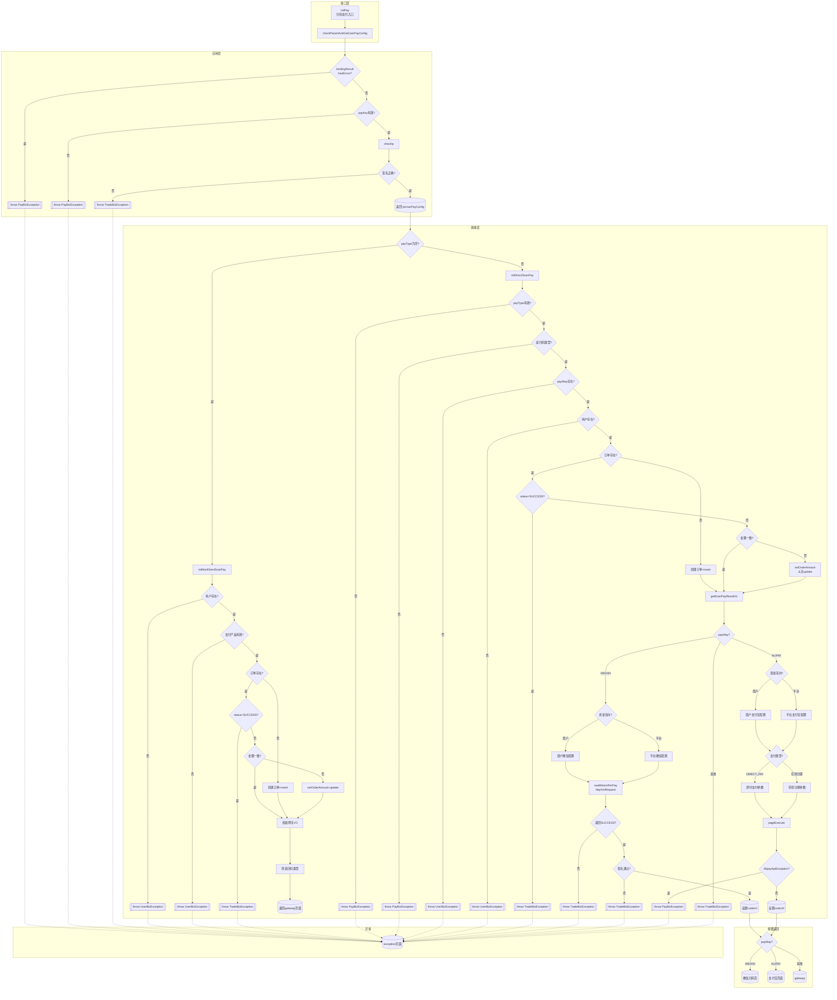

# ScanPayController#initPay — DDD 元素分析

> 分析日期: 2026-05-15
> 入口: `ScanPayController.initPay()` (roncoo-pay-web-gateway/.../ScanPayController.java:85)

---

## 一、流程总览

```
商户系统发起扫码支付请求 (主扫支付)
  │
  ▼
[1] initPay (控制器入口)
  │
  ├─[2] checkParamAndGetUserPayConfig (参数校验 + 商户配置加载)
  │     ├─ Bean Validation 注解校验 (ScanPayRequestBo)
  │     ├─ 根据 payKey 查询商户支付配置 (RpUserPayConfig)
  │     ├─ IP 白名单校验 (checkIp, 可选)
  │     └─ MD5 签名校验 (MerchantApiUtil.isRightSign)
  │
  ├─[3a] initNonDirectScanPay (非直连扫码 — payType 为空)
  │     ├─ 查询商户信息 (RpUserInfo)
  │     ├─ 查询支付方式列表 (RpPayWayService.listByProductCode)
  │     ├─ 查订单/新建订单
  │     │     ├─ 订单不存在 → 创建
  │     │     ├─ 订单已存在 + 状态=SUCCESS → 拒绝
  │     │     └─ 订单已存在 + 金额不一致 → 更新金额+update
  │     └─ 组装网关展示VO (RpPayGateWayPageShowVo)
  │           └─ 遍历支付方式列表，筛选扫码类型 → 返回 gateway 页面
  │
  └─[3b] initDirectScanPay (直连扫码 — payType 非空)
        ├─ 校验支付类型枚举 (SCANPAY/DIRECT_PAY/花呗分期)
        ├─ 查询支付方式 (RpPayWay) + 费率
        ├─ 查询商户信息 (RpUserInfo)
        ├─ 查订单/新建订单 (sealScanPayRpTradePaymentOrder)
        │     ├─ 订单不存在 → 创建(WAITING_PAYMENT)
        │     ├─ 订单已存在 + 状态=SUCCESS → 拒绝
        │     └─ 订单已存在 + 金额不一致 → setOrderAmount(newPrice) — ⚠️ 未调 update
        └─[4] getScanPayResultVo (113行核心方法)
              ├─ 根据 payWayCode 设定 payType → update 订单
              ├─ 创建支付记录 (sealRpTradePaymentRecord → insert)
              ├─ 调用第三方支付渠道:
              │    ├─ 微信: 获取配置 → sealWeixinPerPay → httpXmlRequest 调用预支付API
              │    │     ├─ 返回SUCCESS 且 签名通过 → 保存 bankReturnMsg + 设置 codeUrl
              │    │     ├─ 返回SUCCESS 但 签名失败 → throw TradeBizException
              │    │     └─ 返回失败 → throw TradeBizException
              │    └─ 支付宝: 获取配置 → pageExecute 调用 pagePay API
              │          ├─ 成功 → 保存 bankReturnMsg + 设置 codeUrl
              │          └─ AlipayApiException → throw PayBizException
              ├─ orderSend 异步通知
              └─ 返回 ScanPayResultVo(codeUrl,payWayCode,productName,orderAmount)
                    → 按 payWay 跳转 weixinPayScanPay / alipayDirectPay / gateway(fallback)
```

**异常路径**: 任意步骤的 BizException → 返回 exception/exception (业务异常信息)；Exception → 返回 exception/exception (系统异常)

---

## 二、实体及属性

### 2.1 ScanPayRequestBo — 扫码支付请求 (输入值对象)

| 属性 | 类型 | 校验规则 | 说明 |
|------|------|----------|------|
| payKey | String | @NotNull, @Size(min=16, max=32) | 商户Key |
| productName | String | @NotNull, @Size(max=200) | 商品名称 |
| orderNo | String | @NotNull, @Size(min=5, max=20) | 商户订单号 (幂等键) |
| orderPrice | BigDecimal | @NotNull, @Digits(integer=12, fraction=2) | 订单金额 |
| orderIp | String | @NotNull, @Size(min=1, max=20) | 下单IP |
| orderDate | String | @NotNull, @Size(min=1, max=8) | 订单日期 (yyyyMMdd) |
| orderTime | String | @NotNull, @Size(min=1, max=14) | 订单时间 (yyyyMMddHHmmss) |
| orderPeriod | Integer | @NotNull | 订单有效期（分钟） |
| returnUrl | String | @NotNull, @Size(min=1, max=200) | 页面跳转地址 |
| notifyUrl | String | @NotNull, @Size(min=1, max=200) | 异步通知地址 |
| sign | String | @NotNull | MD5签名 |
| remark | String | (可选) | 支付备注 |
| payType | String | **无校验注解** | 支付类型 (空=非直连, 非空=直连) |
| numberOfStages | Integer | **无校验注解** | 分期付款笔数 |

**关键发现**: payType 无 @NotNull（因为它既是路由键也是可选字段），orderPrice 无下限校验（无 @DecimalMin），orderDate/orderTime 无格式校验（无 @Pattern），numberOfStages 无任何校验。

### 2.2 RpTradePaymentOrder — 支付订单聚合根

继承 `BaseEntity`，BaseEntity 含: id, version, status, creater, createTime, editor, editTime, remark

| 属性 | 类型 | set 守卫 | 说明 |
|------|------|---------|------|
| status | String | (继承 BaseEntity, 无守卫) | **订单状态** — WAITING_PAYMENT/SUCCESS/FAILED |
| orderAmount | BigDecimal | **无守卫** | 订单金额 ⚠️ 可被设为负数 |
| productName | String | null→null 处理 | 商品名称 |
| merchantOrderNo | String | null→null 处理 | 商户订单号 |
| merchantNo | String | null→null 处理 | 商户编号 |
| orderTime | Date | 无守卫 | 订单时间 |
| orderDate | Date | 无守卫 | 订单日期 |
| expireTime | Date | 无守卫 | 订单过期时间 |
| orderPeriod | Integer | 无守卫 | 订单有效期(分钟) |
| returnUrl | String | null→null 处理 | 回调地址 |
| notifyUrl | String | null→null 处理 | 通知地址 |
| payWayCode | String | null→null 处理 | 支付通道 |
| payTypeCode | String | null→null 处理 | 支付方式类型 |
| fundIntoType | String | null→null 处理 | 资金流入类型 |
| isRefund | String | null→null 处理 | 是否退款 (默认 NO) |
| trxNo | String | 无守卫 | 支付流水号 |
| field1~5 | String | null→null 处理 | 扩展字段 |

**关键发现**: setOrderAmount() 无任何守卫 (无 >0 检查)，setStatus() 继承自 BaseEntity 无守卫。

### 2.3 RpTradePaymentRecord — 支付记录 (继承 BaseEntity)

继承 BaseEntity。关键属性: productName, merchantOrderNo, trxNo, bankOrderNo, bankTrxNo, payerPayAmount, payerFee, receiverPayAmount, receiverFee, orderAmount, platCost, platIncome, platProfit, feeRate, payWayCode, payWayName, bankReturnMsg (存储第三方返回结果), paySuccessTime, completeTime

### 2.4 RpUserPayConfig — 商户支付配置 (继承 BaseEntity)

| 属性 | 类型 | 说明 |
|------|------|------|
| payKey | String | 商户Key |
| paySecret | String | 签名密钥 |
| userNo | String | 商户编号 |
| productCode | String | 支付产品编码 |
| fundIntoType | String | 资金流入类型 |
| securityRating | String | 安全等级 (默认MD5) |
| merchantServerIp | String | 商户服务器IP (白名单) |
| auditStatus | String | (继承 BaseEntity.status 外的审核状态) |

### 2.5 ScanPayResultVo — 扫码支付结果 (输出值对象)

| 属性 | 类型 | 说明 |
|------|------|------|
| payWayCode | String | 支付方式编码 |
| orderAmount | BigDecimal | 订单金额 |
| productName | String | 产品名称 |
| codeUrl | String | 二维码地址 (微信) 或 跳转HTML (支付宝) |

### 2.6 RpPayGateWayPageShowVo — 支付网关页面展示 (输出值对象)

| 属性 | 类型 | 说明 |
|------|------|------|
| orderAmount | BigDecimal | 订单金额 |
| productName | String | 产品名称 |
| merchantName | String | 商户名称 |
| merchantOrderNo | String | 商户订单号 |
| payKey | String | 商户支付Key |
| payTypeEnumMap | Map | 支付方式列表 |

---

## 三、活动

### 3.1 活动列表

| 活动名 | 方法 | 所属分层 | 说明 |
|--------|------|----------|------|
| 发起扫码支付 | ScanPayController.initPay() | 接口层 | 统一入口，路由直连/非直连 |
| 参数校验与配置获取 | CnpPayService.checkParamAndGetUserPayConfig() | 应用服务 | 多层校验后获取 RpUserPayConfig |
| 非直连扫码支付 | RpTradePaymentManagerServiceImpl.initNonDirectScanPay() | 领域服务 | 组装网关展示VO |
| 直连扫码支付 | RpTradePaymentManagerServiceImpl.initDirectScanPay() | 领域服务 | 校验→查订单→调用渠道获取code_url |
| 扫码支付结果获取 | RpTradePaymentManagerServiceImpl.getScanPayResultVo() | 领域服务 | 创建支付记录 + 调用微信/支付宝 |
| 扫码订单封装 | sealScanPayRpTradePaymentOrder() | 领域服务(工厂) | 将请求BO+配置组装为支付订单 |
| 支付记录封装 | sealRpTradePaymentRecord() | 领域服务(工厂) | 生成流水号并封装支付记录 |
| 微信预支付 | sealWeixinPerPay() + getPrePayXml() + httpXmlRequest() | 基础设施 | 调用微信统一下单API |
| 支付宝支付 | pageExecute() | 基础设施 | 调用支付宝 pagePay API |

### 3.2 决策点清单

| 编号 | 所在方法 | 行号 | 决策类型 | 条件 | 动作 |
|------|---------|------|---------|------|------|
| D01 | initPay | 93 | if | payType 为空 | initNonDirectScanPay → 返回 gateway |
| D02 | initPay | 99 | else | payType 非空 | initDirectScanPay → 按 payWay 分发 |
| D03 | initPay | 106 | if | payWay=WEIXIN | 设置微信上下文(5个model属性) → 返回 weixinPayScanPay |
| D04 | initPay | 114 | else if | payWay=ALIPAY | 返回 alipayDirectPay |
| D05 | initPay | 117 | else(隐式) | 其他 payWay | 返回 gateway（隐式 fallback） |
| D06 | initPay | 120 | catch | BizException | 返回 exception/exception（业务异常页） |
| D07 | initPay | 125 | catch | Exception | 返回 exception/exception（系统异常页） |
| D08 | checkParamAndGetUserPayConfig | 74 | if | bindingResult.hasErrors() | throw PayBizException(REQUEST_PARAM_ERR) |
| D09 | checkParamAndGetUserPayConfig | 88 | if | rpUserPayConfig==null | throw PayBizException(USER_PAY_CONFIG_IS_NOT_EXIST) |
| D10 | checkParamAndGetUserPayConfig | 93 | 调用 | checkIp | IP校验 → 不通过则 throw 异常 |
| D11 | checkParamAndGetUserPayConfig | 96 | if | 签名验证失败 | throw TradeBizException(TRADE_ORDER_ERROR) |
| D12 | initDirectScanPay | 121 | if | payType==null | throw PayBizException("支付类型有误") |
| D13 | initDirectScanPay | 126 | if | payType 非 SCANPAY/DIRECT_PAY/花呗分期 | throw PayBizException("不支持该支付类型") |
| D14 | initDirectScanPay | 134 | if | payWay==null | throw UserBizException(USER_PAY_CONFIG_ERRPR) |
| D15 | initDirectScanPay | 141 | if | rpUserInfo==null | throw UserBizException(USER_IS_NULL) |
| D16 | initDirectScanPay | 146 | if | 订单不存在 | sealScanPayRpTradePaymentOrder → insert |
| D17 | initDirectScanPay | 150 | if | status=SUCCESS | throw TradeBizException("订单已支付成功") |
| D18 | initDirectScanPay | 153 | if | 金额不一致 | setOrderAmount(newPrice) — ⚠️ 无 update |
| D19 | initNonDirectScanPay | 418 | if | rpUserInfo==null | throw UserBizException(USER_IS_NULL) |
| D20 | initNonDirectScanPay | 423 | if | payWayList 为空 | throw UserBizException(USER_PAY_CONFIG_ERRPR) |
| D21 | initNonDirectScanPay | 428 | if | 订单不存在 | sealScanPayRpTradePaymentOrder → insert |
| D22 | initNonDirectScanPay | 433 | if | status=SUCCESS | throw TradeBizException("订单已支付成功") |
| D23 | initNonDirectScanPay | 437 | if | 金额不一致 | setOrderAmount + **update** |
| D24 | initNonDirectScanPay | 453 | for-if | payType 是 SCANPAY/DIRECT_PAY/花呗分期 | 加入 payTypeEnumMap |
| D25 | getScanPayResultVo | 535 | if | payWay=WEIXIN | 进入微信预支付流程 |
| D26 | getScanPayResultVo | 539 | if | 商户收款 | 读取商户微信配置 |
| D27 | getScanPayResultVo | 545 | else if | 平台收款 | 读取平台微信配置 |
| D28 | getScanPayResultVo | 557 | if | 微信返回成功 | 校验签名 → 设置 codeUrl |
| D29 | getScanPayResultVo | 561 | if | 签名失败 | throw TradeBizException(TRADE_WEIXIN_ERROR) |
| D30 | getScanPayResultVo | 571 | else | 微信返回失败 | throw TradeBizException(TRADE_WEIXIN_ERROR) |
| D31 | getScanPayResultVo | 574 | else if | payWay=ALIPAY | 支付宝支付流程 |
| D32 | getScanPayResultVo | 579 | if | 商户收款 | 读取商户支付宝配置 |
| D33 | getScanPayResultVo | 583 | else if | 平台收款 | 读取平台支付宝配置 |
| D34 | getScanPayResultVo | 594 | if | DIRECT_PAY | 即时支付参数 FAST_INSTANT_TRADE_PAY |
| D35 | getScanPayResultVo | 602 | else if | 花呗分期 | 花呗分期参数(含hb_fq_num) |
| D36 | getScanPayResultVo | 612 | try | 支付宝 pageExecute | 调用支付宝API → 设置 codeUrl |
| D37 | getScanPayResultVo | 621 | catch | AlipayApiException | throw PayBizException(REQUEST_BANK_ERR) |
| D38 | getScanPayResultVo | 626 | else | 其他 payWay | throw TradeBizException(TRADE_PAY_WAY_ERROR) |

**决策分支总数: 38**

---

## 四、业务规则入口（按 12 类框架）

### 4.1 校验规则 (已发现 11 条)

| # | 规则 | 字段 | 实现 |
|---|------|------|------|
| R1 | @NotNull + @Size(16,32) | payKey | ScanPayRequestBo:15-16 |
| R2 | @NotNull + @Size(max=200) | productName | ScanPayRequestBo:19-20 |
| R3 | @NotNull + @Size(5,20) | orderNo | ScanPayRequestBo:23-24 |
| R4 | @NotNull + @Digits(12,2) | orderPrice | ScanPayRequestBo:27-28 |
| R5 | @NotNull + @Size(1,20) | orderIp | ScanPayRequestBo:31-32 |
| R6 | @NotNull + @Size(1,8) | orderDate | ScanPayRequestBo:35-36 |
| R7 | @NotNull + @Size(1,14) | orderTime | ScanPayRequestBo:39-40 |
| R8 | @NotNull | orderPeriod | ScanPayRequestBo:43-44 |
| R9 | @NotNull + @Size(1,200) | returnUrl | ScanPayRequestBo:46-47 |
| R10 | @NotNull + @Size(1,200) | notifyUrl | ScanPayRequestBo:50-51 |
| R11 | @NotNull | sign | ScanPayRequestBo:54-55 |

### 4.2 存在性规则 (已发现 7 条)

| # | 规则 | 实现 |
|---|------|------|
| R12 | payKey → RpUserPayConfig 必须存在 | CnpPayService:88 |
| R15 | payType 必须是有效枚举值 | initDirectScanPay:121 |
| R17 | payWay 必须存在 | initDirectScanPay:134 |
| R18 | rpUserInfo 必须存在 | initDirectScanPay:141 |
| R19 | 支付方式列表非空 | initNonDirectScanPay:423 |
| I1 | (merchantNo, merchantOrderNo) 唯一 | selectByMerchantNoAndMerchantOrderNo |
| — | 微信支付时 RpUserPayInfo 必须存在 | getScanPayResultVo:541 |

### 4.3 安全规则 (已发现 3 条)

| # | 规则 | 实现 |
|---|------|------|
| R13 | IP 白名单 (安全等级=MD5_IP) | CnpPayService.checkIp() |
| R14 | MD5 请求签名验证 | checkParamAndGetUserPayConfig():96 |
| — | 微信预支付返回签名验证 | getScanPayResultVo:561 |

### 4.4 不变规则 (已发现 4 条)

| # | 规则 | 实现 |
|---|------|------|
| I1 | (merchantNo, merchantOrderNo) 唯一 | selectByMerchantNoAndMerchantOrderNo |
| I2 | SUCCESS 不可重复支付 | initDirectScanPay:150, initNonDirectScanPay:433 |
| I3 | 支付记录只增不改 (每次创建新记录) | getScanPayResultVo:533 insert() |
| I4 | fundIntoType 从配置继承 | sealScanPayRpTradePaymentOrder:858 |

### 4.5 计算规则 (已发现 5 条)

| # | 规则 | 实现 |
|---|------|------|
| C1 | expireTime = orderTime + orderPeriod(分钟) | sealScanPayRpTradePaymentOrder:841 |
| C2 | sign = MD5(排序参数&paySecret=xxx).toUpperCase() | MerchantApiUtil.getSign() |
| C3 | 签名验证: 重新计算后比对 | MerchantApiUtil.isRightSign() |
| C4 | 费率: (productCode, payWayCode, payTypeCode) | getByPayWayTypeCode() |
| C5 | 金额不一致时以新金额覆盖(直连) | initDirectScanPay:153-154 |

### 4.6 状态转换规则 (已发现 2 条)

| # | 转换 | 触发 |
|---|------|------|
| — | 初始 → WAITING_PAYMENT | sealScanPay → insert |
| I2 | [禁止] SUCCESS → 任何支付操作 | initDirectScanPay:150, initNonDirectScanPay:433 |

### 4.7 路由规则 (已发现 4 条)

| # | 规则 | 实现 |
|---|------|------|
| T1 | payType 空 → 非直连 | initPay:93 |
| T2 | payWay=WEIXIN → 微信扫码页 | initPay:106 |
| T3 | payWay=ALIPAY → 支付宝页面 | initPay:114 |
| T4 | 非直连 → gateway | initPay:97 |

### 4.8 幂等规则 (已发现 3 条)

| # | 规则 | 实现 |
|---|------|------|
| — | 创建幂等: (merchantNo, orderNo) 只创建一条 | selectBy then insert |
| I2 | 支付幂等: SUCCESS 订单不可重复支付 | 状态判断 |
| C5 | 金额幂等: 金额相同时不更新 | compareTo == 0 跳过 |

### 4.9 时间规则 (已发现 1 条)

| # | 规则 | 实现 |
|---|------|------|
| C1 | expireTime = orderTime + orderPeriod | sealScanPay:841 |

### 4.10 补偿规则 (已发现 2 条)

| # | 规则 | 实现 |
|---|------|------|
| — | 业务异常 → errorMsg + exception 页面 | initPay catch(BizException) |
| — | 系统异常 → "系统异常" + exception 页面 | initPay catch(Exception) |

### 4.11 审计规则 (已发现 2 条)

| # | 规则 | 实现 |
|---|------|------|
| — | 关键步骤 info 日志 | 各处 LOG.info() |
| — | 异常 error 日志 | catch 分支 LOG.error() |

### 4.12 通知规则

| # | 规则 | 实现 |
|---|------|------|
| — | orderSend 启动异步通知 | getScanPayResultVo:629 |

---

## 五、领域事件

| # | 事件名 | 触发时机 | 所属聚合 | 携带数据 |
|---|--------|----------|----------|----------|
| E1 | RequestValidated | Bean Validation 通过 (initPay L91) | 应用层 | ScanPayRequestBo 所有字段 |
| E2 | MerchantSecurityVerified | payKey+IP+签名验证通过 | RpUserPayConfig | payKey, merchantNo |
| E3 | PayTypeVerified | payType 是合法枚举值 | PayTypeEnum | payType, payWayCode |
| E4 | PayConfigVerified | payWay 查询存在 | RpPayWay | payWayCode, payRate |
| E5 | MerchantInfoVerified | rpUserInfo 查询存在 | RpUserInfo | merchantNo, merchantName |
| E6 | PayOrderCreated | 订单不存在→新建 (L146-148) | RpTradePaymentOrder | orderId, merchantNo, orderNo, orderAmount |
| E7 | **PayOrderAmountUpdated** | 直连模式: 重复下单,金额不一致 (L153-154) — ⚠️ 未调 update | RpTradePaymentOrder | oldAmount, newAmount |
| E8 | PayOrderAmountUpdatedPersisted | 非直连模式: 重复下单,金额不一致 (L437-439) | RpTradePaymentOrder | oldAmount, newAmount |
| E9 | DuplicateOrderRejected | 重复下单,已SUCCESS (L150-151) | RpTradePaymentOrder | orderId |
| E10 | PayRecordCreated | 创建支付记录 (getScanPayResultVo L533) | RpTradePaymentRecord | recordId, bankOrderNo, trxNo |
| E11 | ThirdPartyPaymentRequested | 调用微信/支付宝 (L555 / L613) | RpTradePaymentRecord | payWayCode, bankOrderNo |
| E12 | **PaymentCodeUrlGenerated** | 微信返回SUCCESS+验签OK (L561-567) | ScanPayResultVo | codeUrl, payWayCode |
| E13 | **PaymentFailed** | 微信返回失败/验签失败/支付宝异常 (L569/L572/L623) | RpTradePaymentRecord | errCode, errMsg |
| E14 | PayResultReturned | 返回 ScanPayResultVo (L630) | 展示层 | codeUrl, payWayCode, orderNo, orderAmount |
| E15 | NotificationSent | orderSend 启动轮询 (L629) | RpTradePaymentRecord | bankOrderNo |

---

## 六、DDD 分层映射

```
┌─────────────────────────────────────────────────────────┐
│  接口层 (roncoo-pay-web-gateway)                        │
│  ScanPayController.initPay()                            │
│  → 路由: payType空→非直连 / payType非空→直连            │
│  → 返回: weixinPayScanPay / alipayDirectPay / gateway  │
│  → 异常返回: exception/exception                        │
└────────────────────┬────────────────────────────────────┘
                     │
┌────────────────────▼────────────────────────────────────┐
│  应用层 (roncoo-pay-web-gateway)                        │
│  CnpPayService                                          │
│  ├─ checkParamAndGetUserPayConfig()                     │
│  ├─ checkIp()                                           │
│  └─ getErrorResponse()                                  │
└────────────────────┬────────────────────────────────────┘
                     │
┌────────────────────▼────────────────────────────────────┐
│  领域服务层 (roncoo-pay-service)                         │
│  RpTradePaymentManagerServiceImpl                       │
│  ├─ initDirectScanPay()          — 直连扫码领域服务       │
│  ├─ initNonDirectScanPay()       — 非直连扫码领域服务     │
│  ├─ getScanPayResultVo()         — 支付渠道调用编排      │
│  ├─ sealScanPayRpTradePaymentOrder() — 订单工厂          │
│  └─ sealRpTradePaymentRecord()   — 支付记录工厂          │
└────────────────────┬────────────────────────────────────┘
                     │
┌────────────────────▼────────────────────────────────────┐
│  领域模型 (roncoo-pay-service + roncoo-pay-common-core)  │
│  聚合根:                                                 │
│  ├─ RpTradePaymentOrder (交易域)                         │
│  └─ RpUserPayConfig        (用户域)                      │
│  实体: RpTradePaymentRecord, RpUserInfo, RpUserPayInfo   │
│  值对象: ScanPayRequestBo, ScanPayResultVo,              │
│         RpPayGateWayPageShowVo                            │
│  枚举: PayTypeEnum, PayWayEnum, TradeStatusEnum,         │
│        FundInfoTypeEnum, WeiXinTradeTypeEnum             │
└────────────────────┬────────────────────────────────────┘
                     │
┌────────────────────▼────────────────────────────────────┐
│  基础设施层                                              │
│  ├─ RpTradePaymentOrderDao / RpTradePaymentRecordDao    │
│  ├─ RpUserPayConfigService / RpUserInfoService          │
│  ├─ RpPayWayService / RpUserPayInfoService              │
│  ├─ RpNotifyService.orderSend (异步通知/轮询)            │
│  ├─ WeiXinPayUtils (预支付XML + http请求)                │
│  ├─ AlipayClient (支付宝SDK)                             │
│  ├─ MerchantApiUtil (MD5签名计算与验证)                  │
│  └─ WeixinConfigUtil / AlipayConfigUtil (配置读取)      │
└─────────────────────────────────────────────────────────┘
```

---

## 七、活动图



---

## 八、自检清单

| 维度 | 数据源 | 数量 | 图上标注 | 覆盖率 | 遗漏项 |
|------|--------|------|---------|--------|--------|
| 调用方法 | outgoing.calls 去重（核心业务） | 18 | 18 | 100% | — |
| 决策分支 | 源码 if/throw/catch/for | 38 | 38 | 100% | — |
| 实体类读取 | 调用链涉及的实体类 | 6 | 6 | 100% | — |
| 领域事件 | 推断的事件 | 15 | 15 | 100% | — |
| 规则分类覆盖 | 12 类有数据源可查 | 12 | 12 | 100% | — |
| 异常出口 | 源码 throw/catch 语句 | 15 | 15 | 100% | — |
| 字段校验注解 | Bean Validation 注解数 | 11 | 11 | 100% | — |

**总体覆盖率（可计算维度）: 100%**

⚠️ ACCESSES 索引数据不完整，字段级读写操作未从图谱获取，从源码中人工推断。
