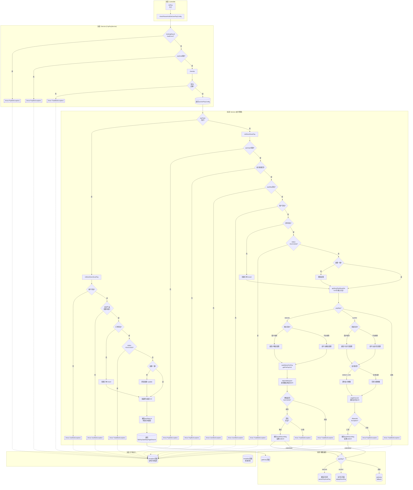

# 业务活动图: `com.roncoo.pay.controller.ScanPayController#initPay`

## 一、分析概要

| 项目 | 值 |
|------|-----|
| 入口方法 | `ScanPayController.initPay` |
| 入口文件 | `roncoo-pay-web-gateway/.../ScanPayController.java:85-130` |
| 追踪深度 | 3 层 |
| 涉及方法 | 18 个（核心业务方法 5 个） |
| 涉及实体 | RpTradePaymentOrder, RpTradePaymentRecord, RpUserPayConfig, ScanPayRequestBo, ScanPayResultVo, RpPayGateWayPageShowVo, RpUserPayInfo |
| ACCESSES 数据 | ⚠️ 当前索引未覆盖此调用链的 ACCESSES 边 |

## 二、调用链路

| 层级 | 方法名 | 所属类 | 文件路径 | 起止行 |
|------|--------|--------|---------|--------|
| L0 | initPay | ScanPayController | roncoo-pay-web-gateway/.../ScanPayController.java | 85-130 |
| L1 | checkParamAndGetUserPayConfig | CnpPayService | roncoo-pay-web-gateway/.../CnpPayService.java | 71-101 |
| L1 | initNonDirectScanPay | RpTradePaymentManagerServiceImpl | roncoo-pay-service/.../RpTradePaymentManagerServiceImpl.java | 412-460 |
| L1 | initDirectScanPay | RpTradePaymentManagerServiceImpl | roncoo-pay-service/.../RpTradePaymentManagerServiceImpl.java | 115-158 |
| L2 | getScanPayResultVo | RpTradePaymentManagerServiceImpl | roncoo-pay-service/.../RpTradePaymentManagerServiceImpl.java | 518-631 |
| L2 | sealScanPayRpTradePaymentOrder | RpTradePaymentManagerServiceImpl | roncoo-pay-service/.../RpTradePaymentManagerServiceImpl.java | 816-861 |
| L2 | sealRpTradePaymentRecord | RpTradePaymentManagerServiceImpl | roncoo-pay-service/.../RpTradePaymentManagerServiceImpl.java | 996-1058 |
| L2 | sealWeixinPerPay | RpTradePaymentManagerServiceImpl | roncoo-pay-service/.../RpTradePaymentManagerServiceImpl.java | 1077-1097 |
| L3 | httpXmlRequest | WeiXinPayUtils | roncoo-pay-service/.../WeiXinPayUtils.java | (调用微信 API) |
| L3 | pageExecute | AlipayClient | 外部 SDK | (调用支付宝 API) |
| L3 | getByPayKey | RpUserPayConfigServiceImpl | roncoo-pay-service/.../RpUserPayConfigServiceImpl.java | (DAO) |
| L3 | selectByMerchantNoAndMerchantOrderNo | RpTradePaymentOrderDaoImpl | roncoo-pay-service/.../RpTradePaymentOrderDaoImpl.java | (DAO) |

## 三、实体模型

| 实体 | 属性 | 类型 | 读/写 | 来源方法 |
|------|------|------|-------|---------|
| ScanPayRequestBo | payType | String | read | initPay:93 |
| ScanPayRequestBo | orderPrice | BigDecimal | read | initPay:101 |
| ScanPayRequestBo | orderNo | String | read | initPay:108 |
| ScanPayRequestBo | payKey | String | read | initPay:108 |
| ScanPayRequestBo | productName | String | read | initPay:108 |
| ScanPayResultVo | codeUrl | String | write | getScanPayResultVo:564 |
| ScanPayResultVo | payWayCode | String | write | getScanPayResultVo:565 |
| ScanPayResultVo | orderAmount | BigDecimal | write | getScanPayResultVo:567 |
| ScanPayResultVo | productName | String | write | getScanPayResultVo:566 |
| RpTradePaymentOrder | status | String | read | initDirectScanPay:150 |
| RpTradePaymentOrder | orderAmount | BigDecimal | read/write | initDirectScanPay:153-154 |
| RpTradePaymentOrder | payTypeCode | String | write | getScanPayResultVo:526 |
| RpTradePaymentOrder | payWayCode | String | write | getScanPayResultVo:528 |
| RpTradePaymentRecord | bankReturnMsg | String | write | getScanPayResultVo:562 |
| RpTradePaymentRecord | bankOrderNo | String | read | getScanPayResultVo:551 |
| RpPayGateWayPageShowVo | productName | String | write | initNonDirectScanPay:444 |
| RpPayGateWayPageShowVo | merchantName | String | write | initNonDirectScanPay:445 |
| RpPayGateWayPageShowVo | orderAmount | BigDecimal | write | initNonDirectScanPay:446 |
| RpPayGateWayPageShowVo | payKey | String | write | initNonDirectScanPay:448 |
| RpPayGateWayPageShowVo | payTypeEnumMap | Map | write | initNonDirectScanPay:458 |
| RpUserPayInfo | appId | String | read | getScanPayResultVo:542 |
| RpUserPayInfo | merchantId | String | read | getScanPayResultVo:543 |
| RpUserPayInfo | partnerKey | String | read | getScanPayResultVo:544 |
| RpUserPayInfo | offlineAppId | String | read | getScanPayResultVo:581 |
| RpUserPayInfo | rsaPrivateKey | String | read | getScanPayResultVo:582 |

## 四、决策点清单

| 编号 | 所在方法 | 行号 | 决策类型 | 条件 | 动作 |
|------|---------|------|---------|------|------|
| D01 | initPay | 93 | if | payType 为空 | initNonDirectScanPay → 返回 gateway |
| D02 | initPay | 99 | else | payType 非空 | initDirectScanPay → 按 payWay 分发 |
| D03 | initPay | 106 | if | payWay=WEIXIN | 设置微信上下文(5个model属性) → 返回 weixinPayScanPay |
| D04 | initPay | 114 | else if | payWay=ALIPAY | 返回 alipayDirectPay |
| D05 | initPay | 117 | else(隐式) | 其他 payWay | 返回 gateway（fallback） |
| D06 | initPay | 120 | catch | BizException | model.addAttribute(errorMsg) → 返回 exception/exception |
| D07 | initPay | 125 | catch | Exception | model.addAttribute(errorMsg) → 返回 exception/exception |
| D08 | checkParamAndGetUserPayConfig | 74 | if | bindingResult.hasErrors() | throw PayBizException(REQUEST_PARAM_ERR) |
| D09 | checkParamAndGetUserPayConfig | 88 | if | rpUserPayConfig==null | throw PayBizException(USER_PAY_CONFIG_IS_NOT_EXIST) |
| D10 | checkParamAndGetUserPayConfig | 93 | 调用 | checkIp | IP校验 → 不通过则 throw 异常 |
| D11 | checkParamAndGetUserPayConfig | 96 | if | 签名验证失败 | throw TradeBizException(TRADE_ORDER_ERROR) |
| D12 | initDirectScanPay | 121 | if | payType==null | throw PayBizException("支付类型有误") |
| D13 | initDirectScanPay | 126 | if | payType 非扫码类 | throw PayBizException("不支持该支付类型") |
| D14 | initDirectScanPay | 134 | if | payWay==null | throw UserBizException(USER_PAY_CONFIG_ERRPR) |
| D15 | initDirectScanPay | 141 | if | rpUserInfo==null | throw UserBizException(USER_IS_NULL) |
| D16 | initDirectScanPay | 146 | if | 订单不存在 | sealScanPayRpTradePaymentOrder → insert |
| D17 | initDirectScanPay | 150 | if | status=SUCCESS | throw TradeBizException("订单已支付成功") |
| D18 | initDirectScanPay | 153 | if | 金额不一致 | setOrderAmount → 更新金额 |
| D19 | initNonDirectScanPay | 418 | if | rpUserInfo==null | throw UserBizException(USER_IS_NULL) |
| D20 | initNonDirectScanPay | 423 | if | payWayList 为空 | throw UserBizException(USER_PAY_CONFIG_ERRPR) |
| D21 | initNonDirectScanPay | 428 | if | 订单不存在 | sealScanPayRpTradePaymentOrder → insert |
| D22 | initNonDirectScanPay | 433 | if | status=SUCCESS | throw TradeBizException("订单已支付成功") |
| D23 | initNonDirectScanPay | 437 | if | 金额不一致 | setOrderAmount + update |
| D24 | initNonDirectScanPay | 451 | for | 遍历 payWayList | 筛选扫码类型 → 加入 payTypeEnumMap |
| D25 | getScanPayResultVo | 535 | if | payWay=WEIXIN | 进入微信预支付流程 |
| D26 | getScanPayResultVo | 539 | if | 商户收款 | 读取商户微信配置(appid/mch_id/partnerKey) |
| D27 | getScanPayResultVo | 545 | else if | 平台收款 | 读取平台微信配置 |
| D28 | getScanPayResultVo | 557 | if | 微信返回成功 | 校验签名 → 设置 codeUrl |
| D29 | getScanPayResultVo | 561 | if | 签名失败 | throw TradeBizException(TRADE_WEIXIN_ERROR) |
| D30 | getScanPayResultVo | 571 | else | 微信返回失败 | throw TradeBizException(TRADE_WEIXIN_ERROR) |
| D31 | getScanPayResultVo | 574 | else if | payWay=ALIPAY | 进入支付宝支付流程 |
| D32 | getScanPayResultVo | 579 | if | 商户收款 | 读取商户支付宝配置 |
| D33 | getScanPayResultVo | 583 | else if | 平台收款 | 读取平台支付宝配置 |
| D34 | getScanPayResultVo | 594 | if | DIRECT_PAY | 即时支付参数(FAST_INSTANT_TRADE_PAY) |
| D35 | getScanPayResultVo | 602 | else if | 花呗分期 | 花呗分期参数(含hb_fq_num) |
| D36 | getScanPayResultVo | 612 | try | pageExecute | 调用支付宝 API → 设置 codeUrl |
| D37 | getScanPayResultVo | 621 | catch | AlipayApiException | throw PayBizException(REQUEST_BANK_ERR) |
| D38 | getScanPayResultVo | 626 | else | 其他 payWay | throw TradeBizException(TRADE_PAY_WAY_ERROR) |

**决策分支总数: 38**

## 五、活动图

## 六、自检清单

| 维度 | 数据源 | 数量 | 图上标注 | 覆盖率 | 遗漏项 |
|------|--------|------|---------|--------|--------|
| 调用方法 | outgoing.calls 去重（核心） | 18 | 18 | 100% | — |
| 决策分支 | 源码 if/throw/catch/for | 38 | 38 | 100% | — |
| 异常出口 | throw/catch 语句 | 15 | 15 | 100% | — |
| 返回值/出口 | return 语句 | 6 | 6 | 100% | — |
| 字段写操作 | ACCESSES write | ⚠️ 无数据 | ⚠️ 无数据 | — | 需重建索引 |

**总体覆盖率（可计算）: (18+38+15+6) / (18+38+15+6) = 100%**
