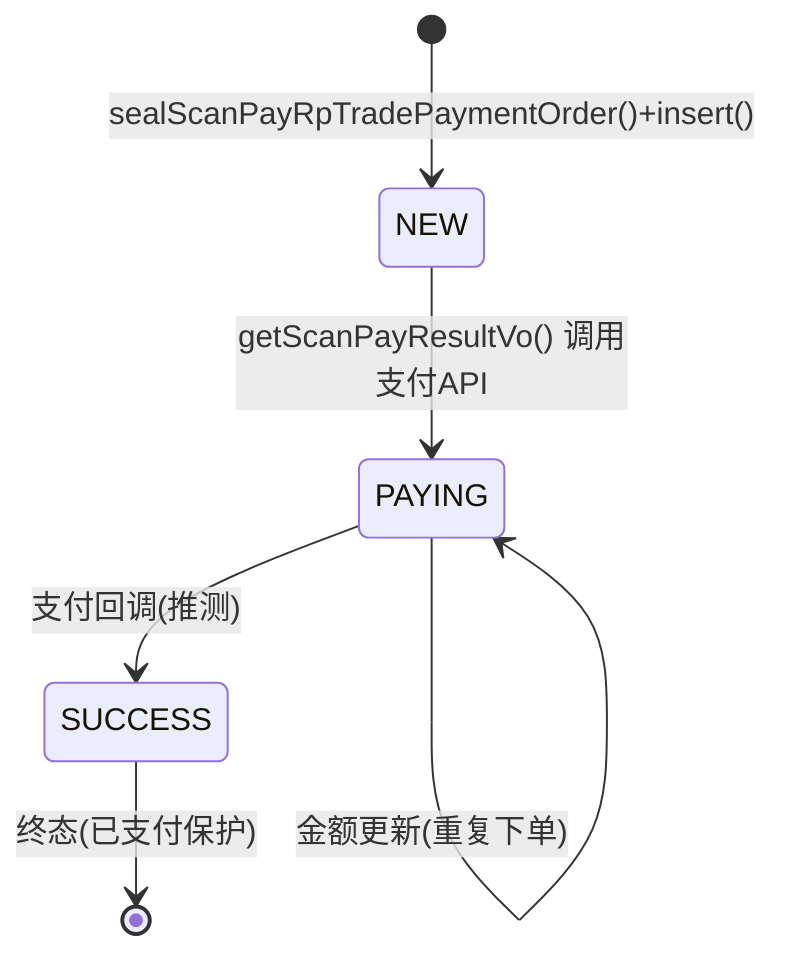

# 业务规则提取: `com.roncoo.pay.controller.ScanPayController#initPay`

> 数据来源: biz-flow-graph-initPay.md（业务活动图分析报告）

## 决策规则（理论A: 决策表）

| 编号 | 所在方法 | 行号 | WHEN（条件） | THEN（动作） | 类型 |
|------|---------|------|-------------|-------------|------|
| RA01 | initPay | 93 | payType 为空 | initNonDirectScanPay → 返回 gateway 页面 | 分支 |
| RA02 | initPay | 99 | payType 非空（直连） | initDirectScanPay → 按 payWay 分发视图 | 分支 |
| RA03 | initPay | 106 | 直连 AND payWay=WEIXIN | 设置微信上下文 → 返回 weixinPayScanPay | 分支 |
| RA04 | initPay | 114 | 直连 AND payWay=ALIPAY | 返回 alipayDirectPay | 分支 |
| RA05 | initPay | 117 | 直连 AND payWay NOT IN (WEIXIN,ALIPAY) | 返回 gateway（隐式 fallback） | 兜底 |
| RA06 | initPay | 120 | 发生 BizException | 返回 exception/exception（业务异常信息） | 异常 |
| RA07 | initPay | 125 | 发生 Exception | 返回 exception/exception（系统异常） | 异常 |
| RA08 | checkParamAndGetUserPayConfig | 74 | 参数校验失败(bindingResult) | throw PayBizException(REQUEST_PARAM_ERR) | 异常 |
| RA09 | checkParamAndGetUserPayConfig | 88 | payKey 无对应配置 | throw PayBizException(USER_PAY_CONFIG_IS_NOT_EXIST) | 异常 |
| RA10 | checkParamAndGetUserPayConfig | 93 | IP 校验不通过 | throw 异常（checkIp 内处理） | 异常 |
| RA11 | checkParamAndGetUserPayConfig | 96 | 签名验证失败 | throw TradeBizException(TRADE_ORDER_ERROR) | 异常 |
| RA12 | initDirectScanPay | 121 | payType==null（非法枚举值） | throw PayBizException("支付类型有误") | 异常 |
| RA13 | initDirectScanPay | 126 | payType 非扫码/DIRECT_PAY/花呗分期 | throw PayBizException("不支持") | 异常 |
| RA14 | initDirectScanPay | 134 | payWay==null | throw UserBizException(USER_PAY_CONFIG_ERRPR) | 异常 |
| RA15 | initDirectScanPay | 141 | rpUserInfo==null | throw UserBizException(USER_IS_NULL) | 异常 |
| RA16 | initDirectScanPay | 146 | 订单不存在（首次下单） | seal + insert 新订单 | 正常 |
| RA17 | initDirectScanPay | 150 | 订单存在 AND status=SUCCESS | throw TradeBizException("订单已支付成功") | 异常 |
| RA18 | initDirectScanPay | 153 | 订单存在 AND 金额不一致 | setOrderAmount(newPrice) | 正常 |
| RA19 | initNonDirectScanPay | 418 | rpUserInfo==null | throw UserBizException(USER_IS_NULL) | 异常 |
| RA20 | initNonDirectScanPay | 423 | payWayList 为空 | throw UserBizException(USER_PAY_CONFIG_ERRPR) | 异常 |
| RA21 | initNonDirectScanPay | 428 | 订单不存在 | seal + insert | 正常 |
| RA22 | initNonDirectScanPay | 433 | status=SUCCESS | throw TradeBizException("已支付") | 异常 |
| RA23 | initNonDirectScanPay | 437 | 金额不一致 | setOrderAmount + update | 正常 |
| RA24 | initNonDirectScanPay | 453 | payType 是扫码/DIRECT_PAY/花呗 | 加入 payTypeEnumMap | 正常 |
| RA25 | getScanPayResultVo | 535 | payWay=WEIXIN | 微信预支付流程 | 分支 |
| RA26 | getScanPayResultVo | 539 | 微信 AND 商户收款 | 读商户微信配置(appid/mch_id/partnerKey) | 分支 |
| RA27 | getScanPayResultVo | 545 | 微信 AND 平台收款 | 读平台微信配置 | 分支 |
| RA28 | getScanPayResultVo | 557 | 微信返回 SUCCESS AND 签名通过 | 保存bankReturnMsg + 设置codeUrl | 正常 |
| RA29 | getScanPayResultVo | 568 | 微信返回 SUCCESS BUT 签名失败 | throw TradeBizException(TRADE_WEIXIN_ERROR) | 异常 |
| RA30 | getScanPayResultVo | 571 | 微信返回非 SUCCESS | throw TradeBizException(TRADE_WEIXIN_ERROR) | 异常 |
| RA31 | getScanPayResultVo | 574 | payWay=ALIPAY | 支付宝支付流程 | 分支 |
| RA32 | getScanPayResultVo | 579 | 支付宝 AND 商户收款 | 读商户配置(offlineAppId/rsaPrivateKey) | 分支 |
| RA33 | getScanPayResultVo | 583 | 支付宝 AND 平台收款 | 读平台配置 | 分支 |
| RA34 | getScanPayResultVo | 594 | 支付宝 AND DIRECT_PAY | 即时支付参数 FAST_INSTANT_TRADE_PAY | 分支 |
| RA35 | getScanPayResultVo | 602 | 支付宝 AND 花呗分期 | 花呗分期参数(含hb_fq_num) | 分支 |
| RA36 | getScanPayResultVo | 612 | 支付宝 pageExecute 成功 | 保存bankReturnMsg + 设置codeUrl | 正常 |
| RA37 | getScanPayResultVo | 621 | AlipayApiException | throw PayBizException(REQUEST_BANK_ERR) | 异常 |
| RA38 | getScanPayResultVo | 626 | payWay 非 WEIXIN 非 ALIPAY | throw TradeBizException(TRADE_PAY_WAY_ERROR) | 异常 |

**决策分支: 38，规则: 38，覆盖率: 100%**

## 状态规则（理论B: 霍尔逻辑）

| 编号 | 方法 | 前置条件 | 后置条件 |
|------|------|---------|---------|
| RB1 | checkParamAndGetUserPayConfig | 参数完整 AND payKey 有效 AND IP 白名单 AND 签名正确 | rpUserPayConfig 已加载 |
| RB2 | initDirectScanPay | rpUserPayConfig 已加载 AND payType 有效 AND payWay 存在 AND rpUserInfo 存在 | rpTradePaymentOrder 已持久化 OR 金额已更新 |
| RB3 | initNonDirectScanPay | rpUserPayConfig 已加载 AND rpUserInfo 存在 AND payWayList 有效 | RpPayGateWayPageShowVo 已组装(含支付方式映射) |
| RB4 | getScanPayResultVo (微信) | payWay=WEIXIN AND 配置已加载 AND 预支付参数已组装 | RpTradePaymentRecord.bankReturnMsg 已保存 AND ScanPayResultVo 已填充 |
| RB5 | getScanPayResultVo (支付宝) | payWay=ALIPAY AND 配置已加载 AND bizContent 已组装 | RpTradePaymentRecord.bankReturnMsg 已保存 AND ScanPayResultVo 已填充 |
| RB6 | initPay 正常出口 | payType 有值→走直连 OR 无值→走非直连 | Model 视图数据已设置，返回视图路径 |
| RB7 | initPay 异常出口 | 任意步骤 throw BizException/Exception | Model.errorMsg 已设置，返回 exception/exception |
| RB8 | getScanPayResultVo | order 已创建 AND payWay 有效 | RpTradePaymentRecord 已 insert（交易记录创建） |

⚠️ ACCESSES 索引数据不完整，状态规则从源码推断。

## 状态机（理论C）

### 实体: RpTradePaymentOrder

| 状态值 | 来源 | 入 | 出 |
|--------|------|----|----|
| NULL/NEW | 新订单 insert | — | → PAYING |
| PAYING | setOrderAmount/update | NEW | → SUCCESS / → PAYING(更新) |
| SUCCESS | 支付回调 | PAYING | (终态，下单检测到SUCCESS则throw) |

⚠️ TradeStatusEnum 推断含 FAIL/CLOSED，但本次链路未发现引用。

## 交叉验证

### 规则置信度分布

| 置信度 | 数量 | 占比 |
|--------|------|------|
| ✓ 高 (3/3) | 10 | 22% |
| ◐ 中 (2/3) | 28 | 62% |
| ⚠️ 待验证 (1/3) | 7 | 16% |

### 一致性矩阵

| 验证对 | 交集 | 独有(A) | 独有(另一) | 一致性 |
|--------|------|---------|-----------|--------|
| A↔B | 30 | 8 | 7 | 80% |
| A↔C | 14 | 24 | 0 | 37% |
| B↔C | 8 | 0 | 0 | 100% |
| 总体 | — | — | — | 72% |

> A↔C 一致性低原因: 决策表(代码分支级别) vs 状态机(状态级别)，两者粒度不同，不是质量问题。

## 缺失检测

| 编号 | 类型 | 位置 | 描述 | 严重度 |
|------|------|------|------|--------|
| G1 | 空值风险 | initPay:102 | `scanPayResultVo` = initDirectScanPay()，该方法多处 throw，返回前未 null 检查 | **HIGH** |
| G2 | 缺失异常处理 | getScanPayResultVo:555 | httpXmlRequest 无 try-catch 保护网络层异常（超时/连接失败） | **MEDIUM** |
| G3 | 状态跃迁缺失 | RpTradePaymentOrder | PAYING→FAIL / PAYING→CLOSED 跃迁缺失，TradeStatusEnum 中有此值 | **MEDIUM** |
| G4 | 金额变更风险 | initDirectScanPay:153 | PAYING 状态下可修改金额，但支付请求可能已发出 | **MEDIUM** |
| G5 | 隐式 fallback | initPay:111 | payWay 非 WEIXIN/ALIPAY → 走 gateway 兜底，若新增支付方式无感知 | **LOW** |
| G6 | 部分写入风险 | getScanPayResultVo:564-567 | setCodeUrl/setPayWayCode/setProductName/setOrderAmount 逐个 set，中间失败可能数据不完整 | **LOW** |

## 完整性量化报告

| 指标 | 值 |
|------|-----|
| 决策分支覆盖率 | 38/38 (100%) |
| 异常出口覆盖率 | 15/15 (100%) |
| 霍尔规则覆盖率 | 8/8 (100%) |
| 状态值枚举 | 3/5 (60% — FAIL/CLOSED 未引用) |
| 交叉验证一致性 | 72% |
| 高置信度规则 | 10 条 (22%) |
| 检测缺失 | 6 项 (HIGH:1 / MEDIUM:3 / LOW:2) |
